# TradingAgents 架构设计文档

## 1. 总体架构

### 1.1 架构概览

TradingAgents 采用 **基于 LangGraph 的多智能体图编排架构**。系统以一个有向状态图（StateGraph）作为核心调度引擎，12 个专业化 LLM 智能体作为图节点按序执行，条件边控制工具调用循环和辩论轮次。

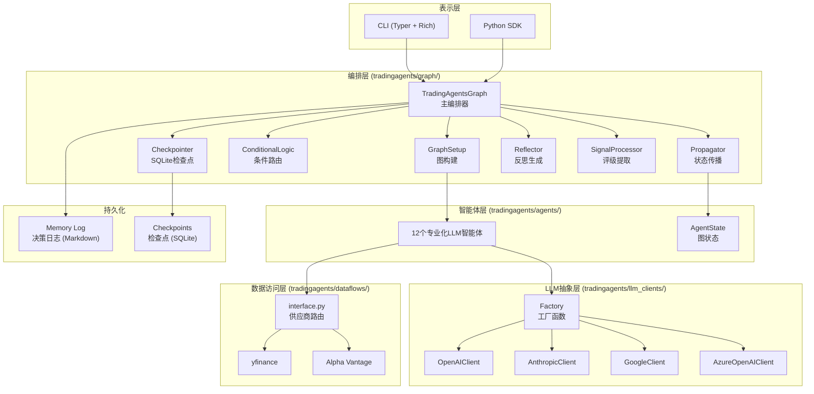

### 1.2 分层设计

| 层 | 包/模块 | 职责 |
|----|---------|------|
| **表示层** | `cli/` | Typer + Rich 交互式 CLI，用户输入收集，实时状态展示 |
| **编排层** | `tradingagents/graph/` | LangGraph 图构建、状态传播、条件路由、检查点、反思 |
| **智能体层** | `tradingagents/agents/` | 12 个专业化 LLM 智能体工厂函数，结构化输出，状态管理 |
| **LLM 抽象层** | `tradingagents/llm_clients/` | 统一 LLM 客户端接口，10+ 提供商支持，模型验证 |
| **数据访问层** | `tradingagents/dataflows/` | 多数据源路由、回退链、前视偏差防护、股票代码安全验证 |
| **配置层** | `tradingagents/default_config.py` | 集中配置管理，支持环境变量覆盖 |

---

## 2. 核心架构组件

### 2.1 LangGraph 工作流

#### 2.1.1 图拓扑

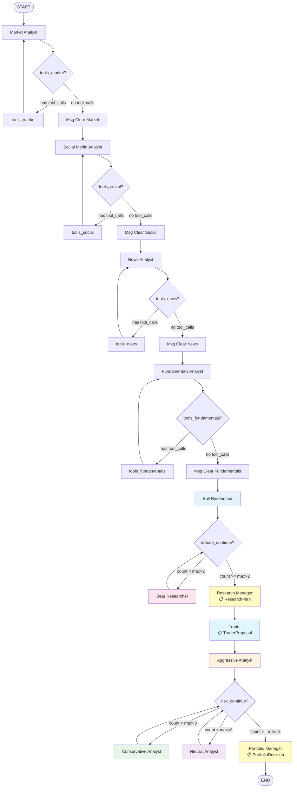

**分析阶段**（4 个分析师依次执行，每个分析师内部包含工具调用循环）：

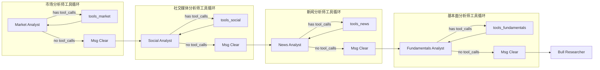

**辩论阶段**（多头/空头辩论循环，以及三方风险辩论循环）：

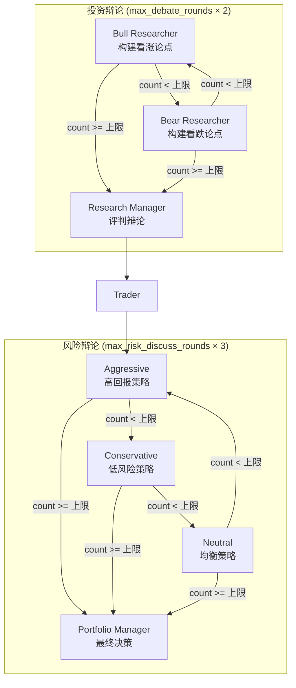

#### 2.1.2 条件路由逻辑

**工具调用循环**（每个分析师节点内部）：当 LLM 返回 `tool_calls` 时路由到工具节点，工具执行完后回到分析师节点继续分析，直到 LLM 不再发起工具调用为止。

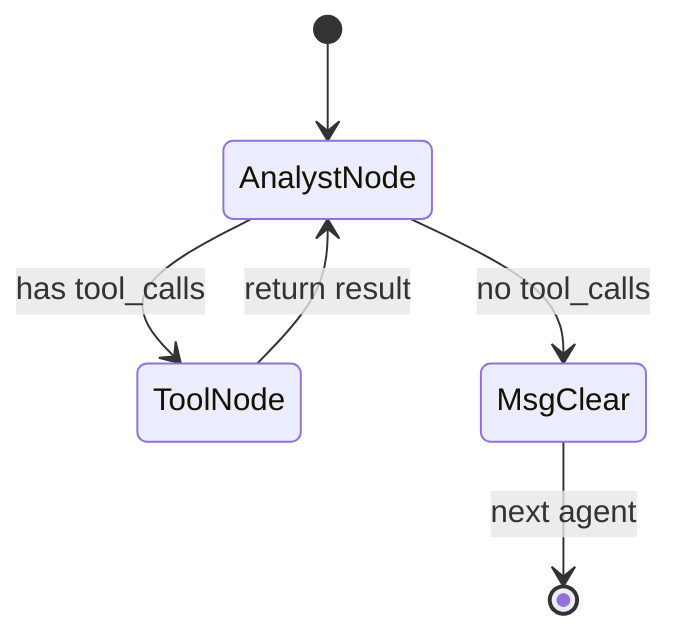

**辩论轮次控制**：根据 `count` 计数器判断是否达到最大轮次，未达到则根据 `current_response` 或 `latest_speaker` 路由到下一个辩论者。

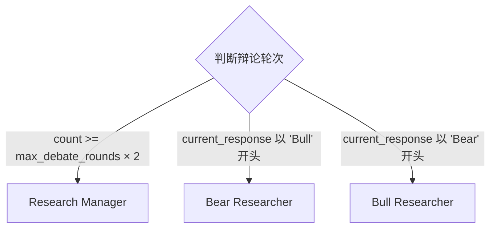

#### 2.1.3 图状态（AgentState）

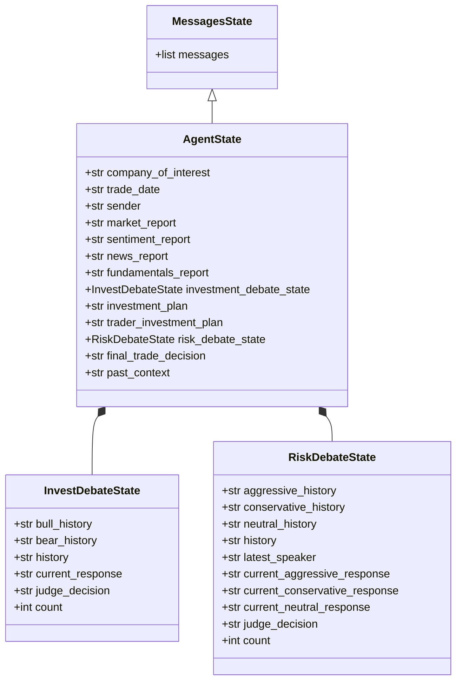

### 2.2 智能体设计

#### 2.2.1 智能体工厂模式

所有智能体通过工厂函数创建，接受 LLM 实例作为参数，返回 LangGraph 节点函数：

```python
def create_market_analyst(llm):
    def market_analyst_node(state: AgentState) -> dict:
        # 构建提示词 → 绑定工具 → 调用 LLM → 更新状态
        return {"market_report": result, "messages": [AIMessage(...)]}
    return market_analyst_node
```

#### 2.2.2 结构化输出机制

三个决策智能体（Research Manager、Trader、Portfolio Manager）使用 Pydantic 结构化输出：

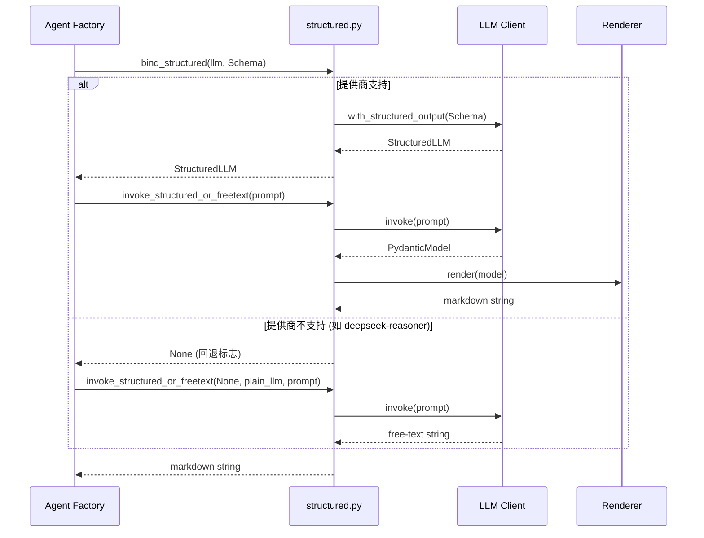

回退策略：
1. 尝试 `with_structured_output(schema)` 绑定
2. 若提供商不支持（如 `deepseek-reasoner` 无 `tool_choice`），回退到 `plain_llm.invoke()`
3. 若结构化调用运行时失败（弱模型返回异常 JSON），捕获异常并回退到自由文本生成

#### 2.2.3 12 个智能体角色

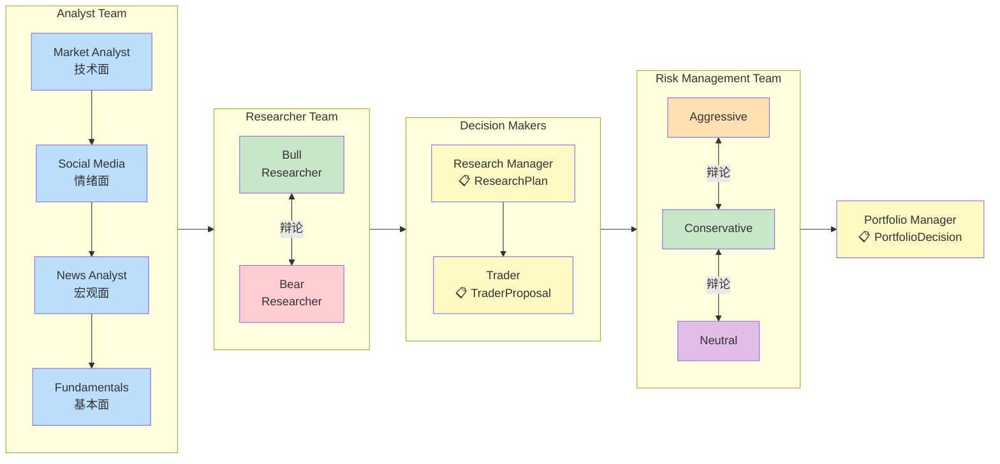

| # | 智能体 | 模块 | LLM 轨道 | 工具 | 结构化输出 |
|---|--------|------|----------|------|-----------|
| 1 | Market Analyst | `analysts/market_analyst.py` | Quick | get_stock_data, get_indicators | — |
| 2 | Social Media Analyst | `analysts/social_media_analyst.py` | Quick | get_news | — |
| 3 | News Analyst | `analysts/news_analyst.py` | Quick | get_news, get_global_news | — |
| 4 | Fundamentals Analyst | `analysts/fundamentals_analyst.py` | Quick | get_fundamentals, get_balance_sheet, get_cashflow, get_income_statement | — |
| 5 | Bull Researcher | `researchers/bull_researcher.py` | Quick | — | — |
| 6 | Bear Researcher | `researchers/bear_researcher.py` | Quick | — | — |
| 7 | Research Manager | `managers/research_manager.py` | Deep | — | ResearchPlan |
| 8 | Trader | `trader/trader.py` | Quick | — | TraderProposal |
| 9 | Aggressive Analyst | `risk_mgmt/aggressive_debator.py` | Quick | — | — |
| 10 | Conservative Analyst | `risk_mgmt/conservative_debator.py` | Quick | — | — |
| 11 | Neutral Analyst | `risk_mgmt/neutral_debator.py` | Quick | — | — |
| 12 | Portfolio Manager | `managers/portfolio_manager.py` | Deep | — | PortfolioDecision |

### 2.3 LLM 客户端架构

#### 2.3.1 类层次结构

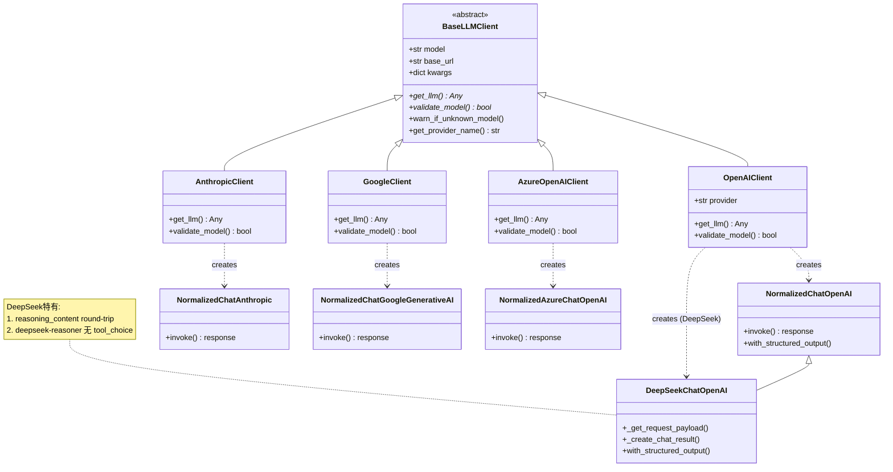

#### 2.3.2 工厂模式与提供商路由

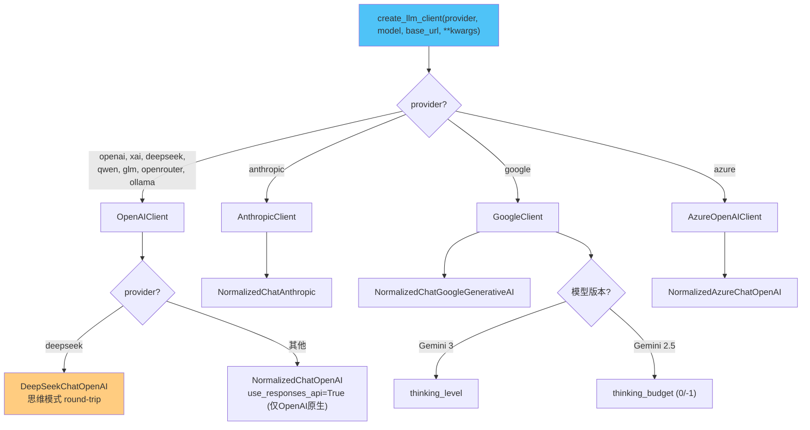

**关键设计点：**
- **懒加载**：提供商模块在 `create_llm_client()` 调用时才导入，避免测试收集时拉取重量级 SDK
- **提供商特定配置**：DeepSeek 的思维模式 round-trip、Gemini 的 thinking_level/budget 等通过 kwargs 传递
- **响应标准化**：`normalize_content()` 处理 OpenAI Responses API 和 Gemini 3 返回的列表结构内容，统一转为纯字符串

### 2.4 数据访问层

#### 2.4.1 供应商路由流程

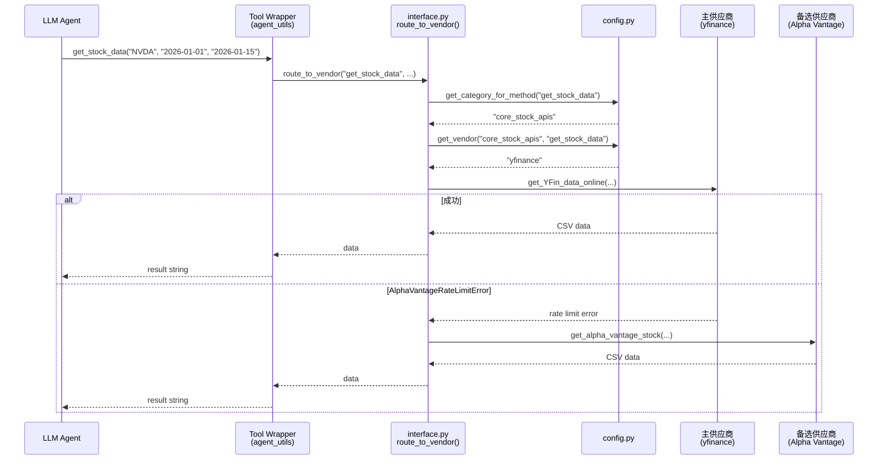

#### 2.4.2 供应商配置层次

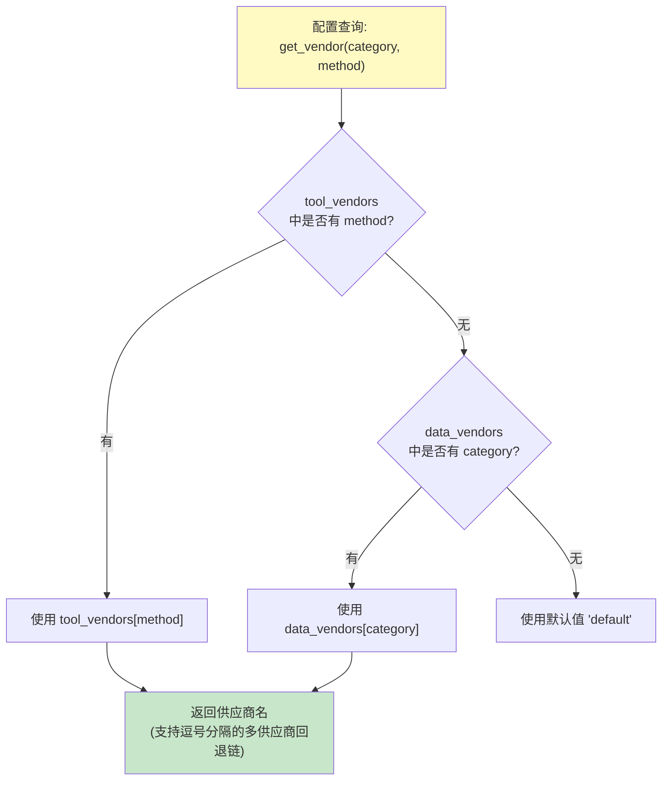

#### 2.4.3 回退链

配置为 `"alpha_vantage,yfinance"` 时：先尝试 Alpha Vantage，仅在发生 `AlphaVantageRateLimitError` 时回退到 yfinance。其他错误（如网络错误）不回退，直接暴露。

### 2.5 记忆系统

#### 2.5.1 决策日志格式

```markdown
[2026-01-15 | NVDA | Buy | +3.2% | +1.1% | 5d]

DECISION:
**Rating**: Buy
**Executive Summary**: ...
**Investment Thesis**: ...

REFLECTION:
Directional call was correct...

<!-- ENTRY_END -->

[2026-01-10 | AAPL | Hold | pending]

DECISION:
**Rating**: Hold
...
<!-- ENTRY_END -->
```

#### 2.5.2 两阶段生命周期

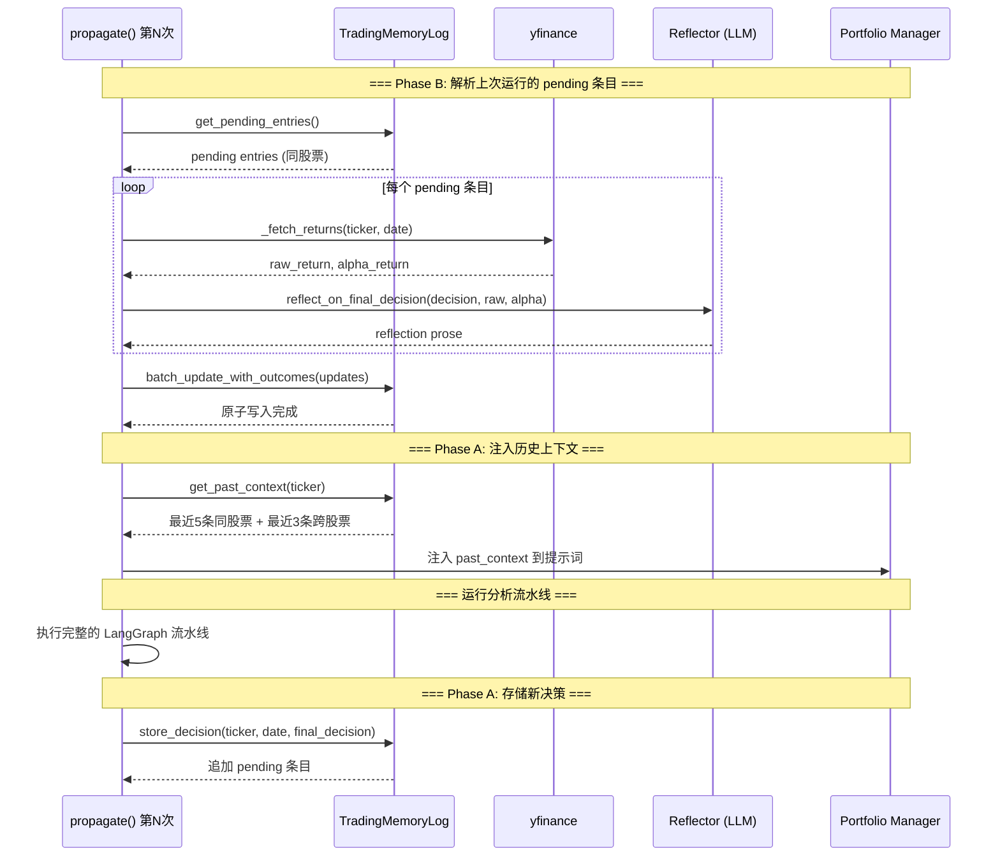

#### 2.5.3 上下文注入策略

在 Portfolio Manager 的提示词中注入：
- **同股票历史**（最近 5 条，完整决策 + 反思）：帮助模型了解该股票的历史分析模式
- **跨股票教训**（最近 3 条，仅反思）：提供跨市场的通用经验

### 2.6 检查点系统

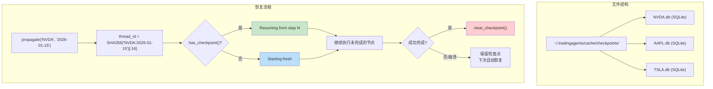

- **每股票独立 DB**：并发运行不竞争
- **thread_id 确定性生成**：`SHA256("TICKER:date")[:16]`，同股票同日期可恢复
- **成功完成自动清除**：避免使用过期状态
- **恢复模式**：日志显示 `Resuming from step N` vs `Starting fresh`

---

## 3. 技术栈

### 3.1 核心技术

| 技术 | 版本 | 用途 |
|------|------|------|
| **Python** | ≥3.10 | 主要开发语言 |
| **LangGraph** | ≥0.4.8 | 智能体图编排、状态管理、检查点 |
| **LangChain Core** | ≥0.3.81 | LLM 抽象、消息模型、工具定义 |
| **LangChain OpenAI** | ≥0.3.23 | OpenAI / xAI / DeepSeek / Qwen / GLM / OpenRouter / Ollama 客户端 |
| **LangChain Anthropic** | ≥0.3.15 | Anthropic Claude 客户端 |
| **LangChain Google GenAI** | ≥4.0.0 | Google Gemini 客户端 |
| **LangChain Experimental** | ≥0.3.4 | 实验性功能支持 |
| **Pydantic** | (隐式依赖) | 结构化输出模式定义（ResearchPlan / TraderProposal / PortfolioDecision） |
| **Typer** | ≥0.21.0 | CLI 框架 |
| **Rich** | ≥14.0.0 | 终端 UI（面板、布局、Markdown 渲染、表格、实时刷新） |
| **Questionary** | ≥2.1.0 | 交互式 CLI 提示 |
| **yfinance** | ≥0.2.63 | Yahoo Finance 数据（OHLCV、基本面、新闻） |
| **stockstats** | ≥0.6.5 | 技术指标计算（SMA/EMA/MACD/RSI/布林带等） |
| **pandas** | ≥2.3.0 | 数据处理与分析 |
| **SQLite** | (标准库) | 检查点持久化 |
| **Requests** | ≥2.32.4 | HTTP 请求（Alpha Vantage API） |

### 3.2 辅助依赖

| 技术 | 用途 |
|------|------|
| **backtrader** | 回测框架（基础依赖） |
| **redis** | 缓存支持（基础依赖） |
| **pytz** | 时区处理 |
| **tqdm** | 进度条显示 |
| **parsel** | HTML/XML 解析 |
| **python-dotenv** | .env 文件加载 |
| **typing-extensions** | TypedDict 支持 |

### 3.3 基础设施

| 技术 | 用途 |
|------|------|
| **Docker** | 容器化部署 |
| **Docker Compose** | 多服务编排（含 Ollama profile） |
| **SQLite** | LangGraph 检查点存储 |
| **文件系统** | Markdown 决策日志、JSON 状态日志 |

---

## 4. 开源组件清单

### 4.1 LLM 提供商 SDK

| 组件 | 许可证 | 说明 |
|------|--------|------|
| [LangChain](https://github.com/langchain-ai/langchain) | MIT | LLM 应用开发框架 |
| [LangGraph](https://github.com/langchain-ai/langgraph) | MIT | 有状态多智能体图编排 |
| [OpenAI Python SDK](https://github.com/openai/openai-python) | Apache 2.0 | OpenAI API 客户端（langchain-openai 依赖） |
| [Anthropic Python SDK](https://github.com/anthropics/anthropic-sdk-python) | MIT | Anthropic API 客户端（langchain-anthropic 依赖） |
| [Google Generative AI SDK](https://github.com/google-gemini/generative-ai-python) | Apache 2.0 | Gemini API 客户端（langchain-google-genai 依赖） |

### 4.2 数据与分析

| 组件 | 许可证 | 说明 |
|------|--------|------|
| [yfinance](https://github.com/ranaroussi/yfinance) | Apache 2.0 | Yahoo Finance 数据接口 |
| [stockstats](https://github.com/jealous/stockstats) | MIT | 股票技术指标计算 |
| [pandas](https://github.com/pandas-dev/pandas) | BSD 3-Clause | 数据处理 |
| [backtrader](https://github.com/mementum/backtrader) | GPL 3.0 | 事件驱动回测框架 |

### 4.3 用户界面

| 组件 | 许可证 | 说明 |
|------|--------|------|
| [Typer](https://github.com/fastapi/typer) | MIT | CLI 框架 |
| [Rich](https://github.com/Textualize/rich) | MIT | 终端富文本渲染 |
| [Questionary](https://github.com/tmbo/questionary) | MIT | 交互式 CLI 提示 |

### 4.4 基础设施

| 组件 | 许可证 | 说明 |
|------|--------|------|
| [LangGraph Checkpoint SQLite](https://github.com/langchain-ai/langgraph) | MIT | SQLite 检查点后端 |
| [Redis](https://github.com/redis/redis-py) | MIT | 缓存后端 |
| [Pydantic](https://github.com/pydantic/pydantic) | MIT | 数据验证与模式定义 |

---

## 5. 关键设计决策

### 5.1 为什么用 LangGraph 而非纯 LangChain？

- **有状态图编排**：12 个智能体的顺序执行、工具调用循环、辩论循环需要复杂的状态管理
- **检查点原生支持**：LangGraph 内置 SQLite 检查点，崩溃恢复无需自建
- **条件路由**：`add_conditional_edges` 天然支持工具调用循环和辩论轮次控制
- **流式执行**：`graph.stream()` 支持逐步获取状态，CLI 实时显示

### 5.2 为什么双轨道 LLM？

- **成本优化**：分析师和辩论者（8 个智能体）使用便宜的快速模型，两个决策智能体使用昂贵的深度模型
- **质量保证**：最终的评级决策需要最强的推理能力
- **灵活性**：用户可独立选择两种模型（如 quick=Haiku, deep=Sonnet）

### 5.3 为什么结构化输出 + 自由文本回退？

- **一致性**：Pydantic 模式确保三个决策智能体的输出遵循标准格式
- **可靠性**：部分提供商/模型不支持 structured output（如 `deepseek-reasoner`），回退确保全兼容
- **可解析性**：Markdown 渲染输出保证 `**Rating**: X` 格式，下游确定性解析无需额外 LLM 调用

### 5.4 为什么追加式 Markdown 决策日志？

- **人类可读**：任何文本编辑器可直接查看
- **写入安全**：文件追加不损坏已有数据；更新使用 temp file + `os.replace` 原子操作
- **LLM 友好**：Markdown 格式可直接注入 LLM 提示词
- **低依赖**：无需数据库服务器，文件系统足矣

### 5.5 为什么每股票独立 SQLite 检查点？

- **并发安全**：不同股票的检查点互不干扰
- **清理简单**：完成直接删除文件即可
- **隔离性**：单个 DB 损坏不影响其他股票

---

## 6. 目录结构

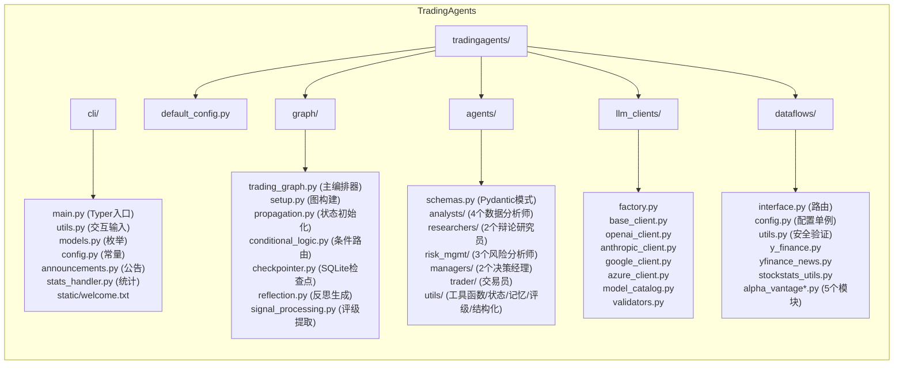

```
TradingAgents/
├── cli/                          # CLI 表示层
│   ├── main.py                   # Typer 应用入口，Rich UI
│   ├── utils.py                  # 交互式用户输入收集
│   ├── models.py                 # AnalystType 枚举
│   ├── config.py                 # CLI 配置常量
│   ├── announcements.py          # 公告获取与显示
│   ├── stats_handler.py          # LLM/Tool 统计回调
│   └── static/welcome.txt        # ASCII 欢迎横幅
│
├── tradingagents/                # 核心库
│   ├── default_config.py         # 集中配置
│   │
│   ├── graph/                    # 图编排层
│   │   ├── trading_graph.py      # 主编排器 TradingAgentsGraph
│   │   ├── setup.py              # 图构建 GraphSetup
│   │   ├── propagation.py        # 状态初始化 Propagator
│   │   ├── conditional_logic.py  # 条件路由 ConditionalLogic
│   │   ├── checkpointer.py       # SQLite 检查点
│   │   ├── reflection.py         # 反思生成 Reflector
│   │   └── signal_processing.py  # 评级提取 SignalProcessor
│   │
│   ├── agents/                   # 智能体层
│   │   ├── schemas.py            # Pydantic 结构化输出模式
│   │   ├── analysts/             # 4 个数据收集分析师
│   │   ├── researchers/          # 2 个辩论研究员
│   │   ├── risk_mgmt/            # 3 个风险分析师
│   │   ├── managers/             # 2 个决策经理
│   │   ├── trader/               # 交易员
│   │   └── utils/                # 工具函数、状态定义、记忆日志、评级解析、结构化回退
│   │
│   ├── llm_clients/              # LLM 抽象层
│   │   ├── factory.py            # 工厂函数
│   │   ├── base_client.py        # 抽象基类 + 内容标准化
│   │   ├── openai_client.py      # OpenAI + 6 兼容提供商
│   │   ├── anthropic_client.py   # Anthropic Claude
│   │   ├── google_client.py      # Google Gemini
│   │   ├── azure_client.py       # Azure OpenAI
│   │   ├── model_catalog.py      # 模型目录
│   │   └── validators.py         # 模型验证
│   │
│   └── dataflows/                # 数据访问层
│       ├── interface.py          # 供应商路由与回退
│       ├── config.py             # 运行时配置单例
│       ├── utils.py              # 安全工具（safe_ticker_component）
│       ├── y_finance.py          # yfinance 实现
│       ├── yfinance_news.py      # yfinance 新闻
│       ├── stockstats_utils.py   # stockstats 封装
│       ├── alpha_vantage.py      # Alpha Vantage 聚合导出
│       ├── alpha_vantage_common.py     # AV 公共工具
│       ├── alpha_vantage_stock.py      # AV 股票数据
│       ├── alpha_vantage_indicator.py  # AV 技术指标
│       ├── alpha_vantage_fundamentals.py # AV 基本面
│       └── alpha_vantage_news.py       # AV 新闻
│
├── tests/                        # 测试
│   ├── conftest.py               # Pytest fixtures
│   ├── test_signal_processing.py
│   ├── test_memory_log.py
│   ├── test_structured_agents.py
│   ├── test_checkpoint_resume.py
│   ├── test_deepseek_reasoning.py
│   ├── test_google_api_key.py
│   ├── test_model_validation.py
│   ├── test_safe_ticker_component.py
│   └── test_ticker_symbol_handling.py
│
├── scripts/                      # 辅助脚本
│   └── smoke_structured_output.py
│
├── Dockerfile                    # 多阶段 Docker 构建
├── docker-compose.yml            # Docker Compose (含 Ollama profile)
├── pyproject.toml                # 构建配置与依赖
├── main.py                       # 快速启动示例
├── CHANGELOG.md                  # 版本历史
└── README.md                     # 项目文档
```
