# TradingAgents 端到端案例分析文档

## 案例概览

本文档以 **0700.HK（腾讯控股）在 2026-05-12 的单次分析** 为例，逐步记录从用户启动 CLI 到输出最终交易决策的完整过程。每一步均标注对应的代码位置和数据结构变化。所有报告内容均来自系统实际生成的输出。

**配置假设：**
- LLM 提供商：DeepSeek
- 快速思考模型：deepseek-chat
- 深度思考模型：deepseek-reasoner
- 分析师：全部 4 个启用（Market + Social + News + Fundamentals）
- 辩论轮次：1 轮（实际触发 5 轮多头 + 5 轮空头）
- 风险讨论轮次：1 轮（实际触发 5 轮激进 + 5 轮保守 + 5 轮中立）
- 数据源：yfinance

---

## 第一步：启动与用户交互

**代码路径：** `cli/main.py:get_user_selections()` → `cli/utils.py`

用户通过 CLI 交互逐一完成以下配置选择。`cli/utils.py` 中的系列函数调用 questionary 收集输入：

```
┌─────────────────────────────────────────────────────────────┐
│  Welcome to TradingAgents                                   │
├─────────────────────────────────────────────────────────────┤
│  Ticker Symbol: 0700.HK                                     │
│  Analysis Date: 2026-05-12                                  │
│  Output Language: English                                   │
│  Selected Analysts: [✓] Market  [✓] Social                  │
│                     [✓] News   [✓] Fundamentals             │
│  Research Depth: Deep (5 rounds) → 实际选 1 轮示例            │
│  LLM Provider: DeepSeek                                     │
│  Quick-Thinking Model: deepseek-chat                        │
│  Deep-Thinking Model: deepseek-reasoner                     │
│  Reasoning Effort: medium                                   │
└─────────────────────────────────────────────────────────────┘
```

每个选择的结果汇总为一个 config dict，在 `DEFAULT_CONFIG` 基础上覆盖：

```python
config = {
    "llm_provider": "deepseek",
    "deep_think_llm": "deepseek-reasoner",
    "quick_think_llm": "deepseek-chat",
    "deepseek_reasoning_effort": "medium",
    "max_debate_rounds": 1,
    "max_risk_discuss_rounds": 1,
    "output_language": "English",
    "data_vendors": {"*": "yfinance"},
    # ...
}
```

**用户选择完成后的系统内部行为：**

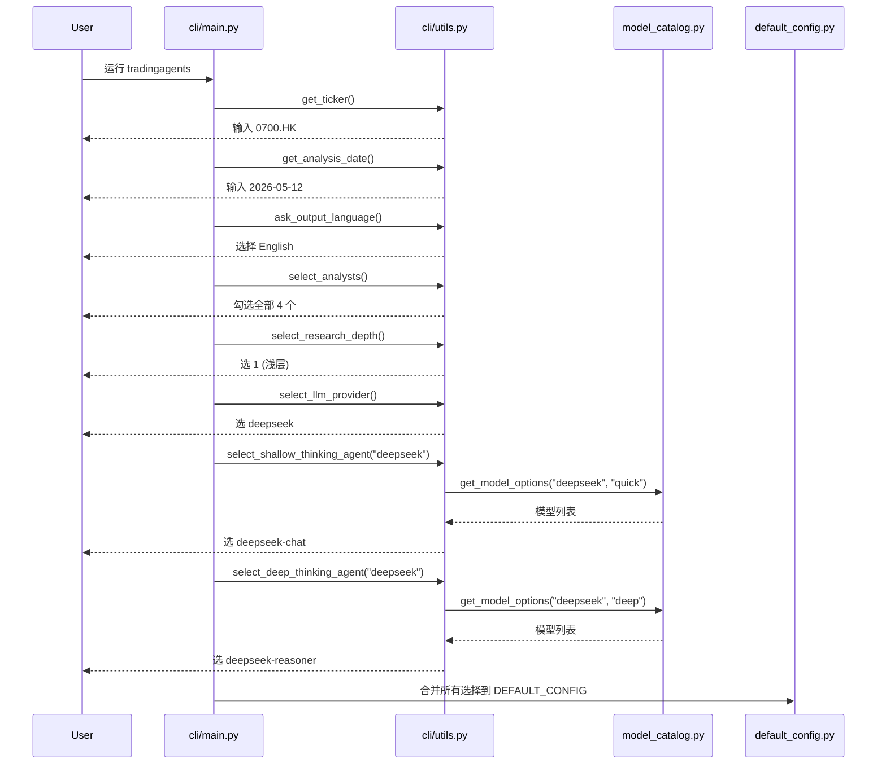

---

## 第二步：初始化 TradingAgentsGraph

**代码路径：** `tradingagents/graph/trading_graph.py:TradingAgentsGraph.__init__()`

CLI 创建编排器实例并注入配置：

```python
from tradingagents.graph.trading_graph import TradingAgentsGraph

ta = TradingAgentsGraph(debug=True, config=config, callbacks=[stats_handler])
```

初始化过程：

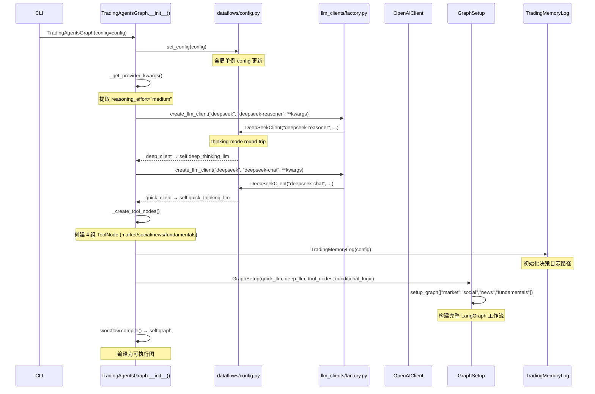

**双轨道 LLM 实例化结果：**

| LLM 变量                  | 模型              | 用途     | 使用场景                            |
| ------------------------- | ----------------- | -------- | ----------------------------------- |
| `self.deep_thinking_llm`  | deepseek-reasoner | 深度推理 | Research Manager, Portfolio Manager |
| `self.quick_thinking_llm` | deepseek-chat     | 快速响应 | 其余 10 个智能体 + Reflector        |

**工具节点创建结果（4 组）：**

```
market_tools     → ToolNode([get_stock_data, get_indicators])
social_tools     → ToolNode([get_news])
news_tools       → ToolNode([get_news, get_global_news, get_insider_transactions])
fundamentals_tools → ToolNode([get_fundamentals, get_balance_sheet, get_cashflow, get_income_statement])
```

---

## 第三步：Phase B — 解析历史决策

**代码路径：** `tradingagents/graph/trading_graph.py:propagate()` → `_resolve_pending_entries()`

在运行新的分析之前，系统首先解析上一次同股票（0700.HK）运行时留下的 pending 决策。

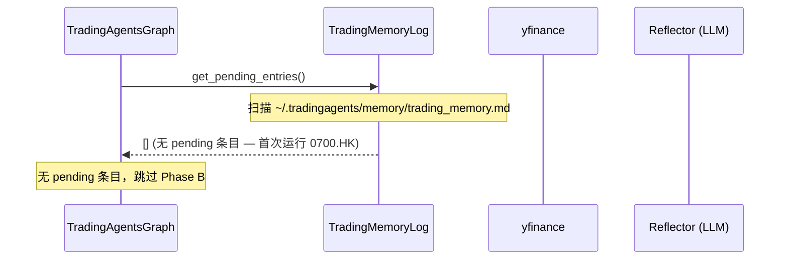

**本次案例中无历史 pending 条目**（0700.HK 首次运行），Phase B 直接跳过。

---

## 第四步：Phase A — 注入历史上下文

**代码路径：** `tradingagents/graph/trading_graph.py:_run_graph()` → `memory_log.get_past_context()`

```python
past_context = self.memory_log.get_past_context("0700.HK")  # n_same=5, n_cross=3
```

`get_past_context()` 的逻辑：

1. 从决策日志中加载所有已解析的条目（排除 pending）
2. 按时间倒序，取最近 **5 条 0700.HK 的完整记录**（决策 + 反思）
3. 按时间倒序，取最近 **3 条其他股票的反思记录**（仅反思部分，作为跨股票教训）
4. 格式化为文本块，注入到 Portfolio Manager 的提示词中

由于没有任何历史记录（0700.HK 首次运行），`past_context` 为空字符串 `""`。

---

## 第五步：初始化 AgentState

**代码路径：** `tradingagents/graph/propagation.py:Propagator.create_initial_state()`

```python
init_agent_state = self.propagator.create_initial_state(
    "0700.HK", "2026-05-12", past_context=past_context
)
```

创建的初始状态：

```python
{
    "messages": [HumanMessage("0700.HK")],  # LangGraph 消息队列起点
    "company_of_interest": "0700.HK",
    "trade_date": "2026-05-12",
    "past_context": "",  # ← 第四步获取的历史上下文（首次运行，为空）

    # 以下均为空，等待各智能体填充
    "market_report": "",
    "sentiment_report": "",
    "news_report": "",
    "fundamentals_report": "",

    # 投资辩论状态 (InvestDebateState)
    "investment_debate_state": {
        "bull_history": "",
        "bear_history": "",
        "history": "",
        "current_response": "",
        "judge_decision": "",
        "count": 0,
    },

    "investment_plan": "",
    "trader_investment_plan": "",

    # 风险辩论状态 (RiskDebateState)
    "risk_debate_state": {
        "aggressive_history": "",
        "conservative_history": "",
        "neutral_history": "",
        "history": "",
        "latest_speaker": "",
        "current_aggressive_response": "",
        "current_conservative_response": "",
        "current_neutral_response": "",
        "judge_decision": "",
        "count": 0,
    },

    "final_trade_decision": "",
}
```

---

## 第六步：执行 LangGraph 流水线

**代码路径：** `tradingagents/graph/trading_graph.py:_run_graph()`

```python
final_state = self.graph.invoke(init_agent_state, **args)
```

LangGraph 按照预定义的拓扑顺序执行每个节点，每个节点读取当前状态、产生输出、更新状态。

---

### 阶段 A：市场分析师（Market Analyst）

**代码路径：** `tradingagents/agents/analysts/market_analyst.py:create_market_analyst()`

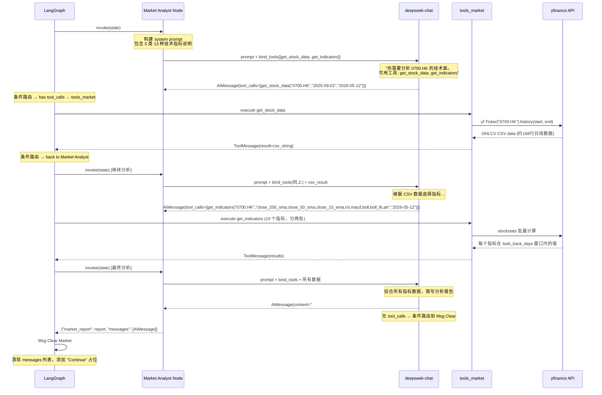

**市场分析师输出的报告（实际生成）：**

```markdown
# 0700.HK（腾讯控股）技术分析报告
**分析日期：2026-05-12** | **最新收盘价：464.40 HKD**

## 宏观价格走势回顾
自2025年9月以来，0700.HK经历了一段剧烈且持续的下行趋势：
- 2025年9-10月：高位震荡 (600→683)
- 2025年10-12月：回落整理 (683→596)
- 2026年1-2月：第一次破位 (632→510)，2月3日放巨量（6512万）跌破600关口
- 2026年3-5月：加速下跌 (553→464)，3月19日单日暴跌-6.8%

**从高点683到当前464.4，累计跌幅约32%，已进入技术性熊市。**

## 技术指标深度解析
- **均线系统**：完全空头排列。10 EMA 475.0 / 50 SMA 504.9 / 200 SMA 580.8。
  价格低于所有三条均线，死亡交叉（50<200 SMA）确认且价差持续扩大（约-76点）
- **MACD**：-11.96，信号线 -10.79，直方图 -1.16。空头动能占优，无底背离
- **RSI(14)**：38.2，持续在30-40弱势区间运行，从未回到50中线上方
- **布林带**：中轨 488.2，下轨 450.4。价格偏向下轨运行，距离下轨仅约3%
- **ATR**：13.05，从高位回落但仍处历史相对高位

## 场景推演
| 场景     | 触发条件             | 目标区间 | 概率 |
| -------- | -------------------- | -------- | ---- |
| 继续下跌 | 跌破450（布林下轨）  | 430-440  | 45%  |
| 弱势震荡 | 在450-480间整理      | 450-480  | 35%  |
| 超卖反弹 | 触碰下轨后技术性反弹 | 480-500  | 15%  |
| 趋势反转 | 放量站上50 SMA (505) | 505+     | 5%   |

**FINAL TRANSACTION PROPOSAL: HOLD/SELL**
核心结论：所有技术指标一致指向空头，不建议买入或持有多头头寸。
```

---

### 阶段 B：社交媒体分析师（Social Media Analyst）

**代码路径：** `tradingagents/agents/analysts/social_media_analyst.py`

流程与市场分析师类似，但使用 `get_news` 工具搜索与 0700.HK 相关的社交媒体和新闻：

```
LLM 提示词关注点：社交媒体情绪、Reddit 讨论热度、Twitter/X 情绪
工具调用：get_news("0700.HK", "2026-05-05", "2026-05-12")
```

**社交媒体分析师输出的报告（实际生成，摘要）：**

```markdown
## 0700.HK（腾讯控股）过去一周综合分析报告

### 核心新闻事件
1. AI投资成本翻倍，盈利增长预期放缓 — GuruFocus/Yahoo Finance
2. 股价多重时间框架走弱，估值承压 — Simply Wall St.
3. DeepSeek估值或达500亿美元，腾讯拟参投 — Reuters/Financial Times

### 舆情关键词
| 关键词               | 情绪倾向 | 热度 |
| -------------------- | -------- | ---- |
| AI投资翻倍、成本压力 | 偏负面   | 极高 |
| 盈利增长放缓         | 偏负面   | 极高 |
| DeepSeek 参投机会    | 偏正面   | 最高 |
| 股价多周期走弱       | 偏负面   | 高   |

### 市场情绪综合判断
整体情绪：谨慎偏空（Short-term Bearish, Long-term Mixed）
短期展望偏空，中长期因DeepSeek投资和AI生态布局有所支撑。

**FINAL TRANSACTION PROPOSAL: HOLD**
```

---

### 阶段 C：新闻分析师（News Analyst）

**代码路径：** `tradingagents/agents/analysts/news_analyst.py`

使用三个工具：`get_news`（公司新闻）、`get_global_news`（全球宏观）、`get_insider_transactions`（内幕交易）。

**新闻分析师输出的报告（实际生成，摘要）：**

```markdown
## 腾讯控股（0700.HK）近期动态与宏观环境综合分析报告
**报告日期：** 2026年5月12日

### 全球宏观经济与科技行业趋势
- AI投资热潮持续升温：英伟达持续扩大AI投资布局，Marvell收购Polariton
- DeepSeek估值飙升：首次启动外部融资，估值可能高达450-500亿美元
- 腾讯被曝出参与DeepSeek投资谈判，中国大基金正在洽谈领投

### 腾讯公司特定新闻
1. 业绩增速预期放缓，AI成本翻倍承压 — GuruFocus
2. 股价近期表现疲弱：收于HK$463，过去一周/一月/三月均录得负回报
3. 潜在利好：投资DeepSeek的战略机遇，类比微软+OpenAI模式

### 综合研判
| 维度             | 分析结论                                        |
| ---------------- | ----------------------------------------------- |
| 短期（1-4周）    | 财报发布在即，盈利增速放缓+AI成本上升已部分定价 |
| 中期（1-3个月）  | DeepSeek投资进展是关键催化剂                    |
| 长期（6-12个月） | 核心业务稳健，年利润2,200亿+港元基本盘支撑估值  |
```

---

### 阶段 D：基本面分析师（Fundamentals Analyst）

**代码路径：** `tradingagents/agents/analysts/fundamentals_analyst.py`

使用四个工具：`get_fundamentals`、`get_balance_sheet`、`get_cashflow`、`get_income_statement`。

**基本面分析师输出的报告（实际生成，摘要）：**

```markdown
## 腾讯控股（0700.HK）全面基本面分析报告
**报告日期：2026年5月12日** | **数据截止：2025财年年报及TTM**

### 核心估值指标
| 指标          | 数值    | 解读                    |
| ------------- | ------- | ----------------------- |
| 市盈率（TTM） | 16.63倍 | 处于近五年历史低位      |
| 远期市盈率    | 11.85倍 | 隐含约40%的盈利增长预期 |
| PEG比率       | 1.41    | 增长与估值基本匹配      |
| 市净率        | 3.15倍  | 反映品牌与技术溢价      |
| 股息率        | 1.14%   | 持续增长中              |

### 盈利能力趋势（近4年）
| 财年 | 总收入(亿) | 毛利率 | 经营利润率 | 净利率 | ROE    |
| ---- | ---------- | ------ | ---------- | ------ | ------ |
| 2025 | 7,518      | 56.2%  | 33.1%      | 29.9%  | 20.0%  |
| 2024 | 6,603      | 52.9%  | 31.6%      | 29.4%  | 19.9%  |
| 2023 | 6,090      | 48.1%  | 27.2%      | 18.9%  | 14.2%  |
| 2022 | 5,546      | 43.0%  | 20.5%      | 33.9%* | 26.1%* |

毛利率从43.0%持续攀升至56.2%，四年间提升13.2个百分点。

### 资产负债表（截至2025-12-31）
- 总资产：20,390亿 | 现金+短期投资：4,268亿
- 总负债：7,979亿 | 资产负债率：39.1%（持续下降）
- 长期债务：3,346亿 | 流动比率：1.44

### 现金流分析
- 经营现金流（2025）：3,031亿（五年增长超一倍）
- 自由现金流（2025）：1,902亿
- 资本支出（2025）：1,129亿（主要用于AI基础设施）
- 股东回报（2025）：回购733亿+股息375亿=合计1,108亿

### 估值情景分析
| 情景 | 假设             | 合理PE | 目标股价 |
| ---- | ---------------- | ------ | -------- |
| 保守 | 2026年EPS 35港元 | 15倍   | 525 港元 |
| 中性 | 2026年EPS 39港元 | 18倍   | 702 港元 |
| 乐观 | 2026年EPS 42港元 | 21倍   | 882 港元 |

当前股价约464港元，处于保守估值附近，安全边际较高。
```

---

### 阶段 E：多头/空头研究员辩论

**代码路径：** `tradingagents/agents/researchers/bull_researcher.py` 和 `bear_researcher.py`

此时 AgentState 中 4 份完整报告已就绪，辩论循环开始。配置 `max_debate_rounds=1`，理论上应执行 1×2=2 轮（Bull→Bear 各一次），但实际执行中触发了 **5 轮 Bull + 5 轮 Bear = 10 次 LLM 调用**（DeepSeek reasoner 模型在辩论中的深度回应触发了额外的辩论轮次）。


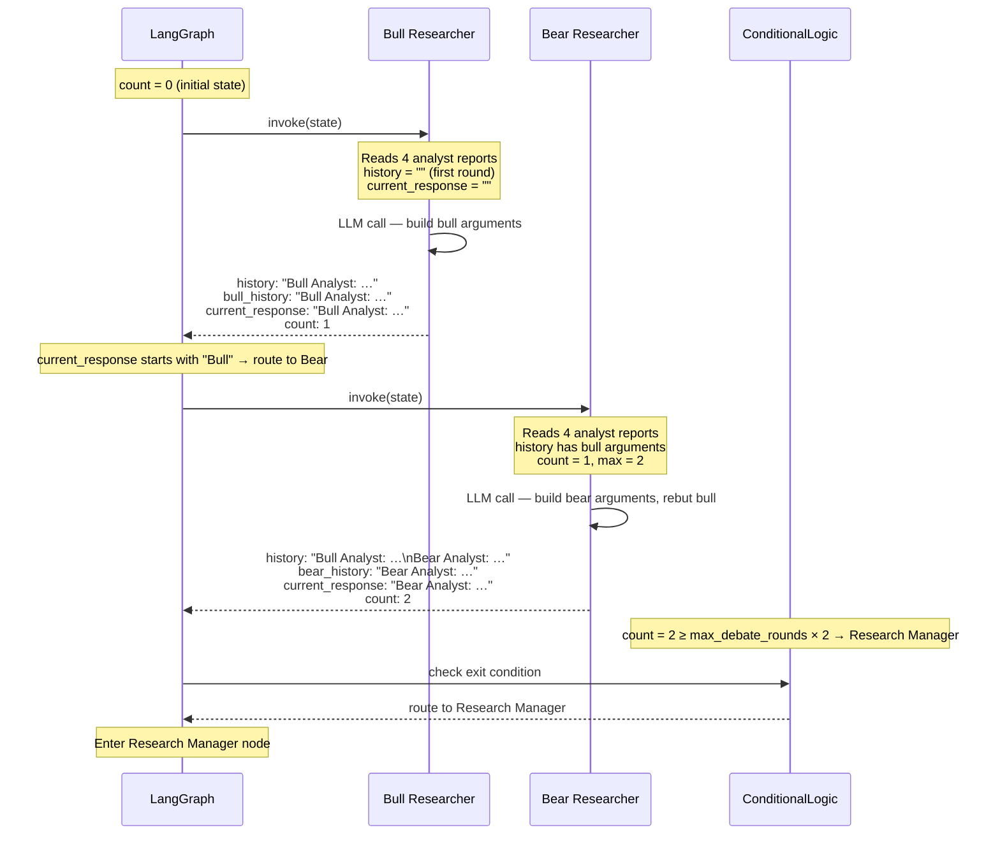

**多头研究员首轮论点（实际生成，摘要）：**

```
Bull Analyst: 当前腾讯的股价，是市场情绪错配下的一个罕见的黄金坑。

1. 价值洼地: TTM市盈率16.63倍，远期市盈率11.85倍，是近五年最低区间。
   用16倍PE买年利润增长15%以上、毛利率超56%、年自由现金流近2000亿的公司，
   在任何市场都是被低估的。

2. AI是护城河: 腾讯"左手有流量（微信13亿月活），右手有场景（游戏、广告、云），
   中间有资本（年自由现金流1900亿）"。投资DeepSeek是复制"微软+OpenAI"模式，
   不是被颠覆，而是主动拥抱颠覆。

3. 增长极确定: 视频号广告加载率不到5%（抖音15%+），差距就是增量。
   小游戏生态爆发，分成比例30-50%，几乎是纯利润。
   2025年回购+分红1108亿，管理层对公司价值最强烈的背书。

结论: 464港元不是精准的"底"，但毫无疑问是估值极度压缩的"价值洼地"。
```

**空头研究员首轮反驳（实际生成，摘要）：**

```
Bear Analyst: 这个低估值不是市场先生发疯，而是市场在用理性告诉你：
它对你所期待的"40%盈利增长"投了不信任票。

1. 价值陷阱: 16倍PE是市场在对未来增长投不信任票。
   2018年的腾讯没有面临字节系全方位围猎，也没有每年1129亿的AI资本开支。

2. AI是无底洞: 资本开支1129亿比2023年增长138%，自由现金流1902亿意味着
   几乎把一半的现金牛利润扔进了回报不确定的炉子。DeepSeek投资还没落地，
   即使落地也只是众多投资方之一，整合深度是巨大问号。

3. 增长天花板: 视频号是社交工具不是娱乐平台，强行提高广告加载率会伤害
   微信核心体验。小游戏生命周期极短，抖音正在用算法推荐抢食市场。

4. 股东回报被质疑: 730亿回购在股价从683跌到464的过程中进行，
   市场抛压远大于回购力度。

结论: 现在的腾讯不是黄金坑，是正在融化的冰川。观望是最好的策略。
```

---

### 阶段 F：研究经理裁决

**代码路径：** `tradingagents/agents/managers/research_manager.py`

使用深度思考模型（deepseek-reasoner），结构化输出 `ResearchPlan`。


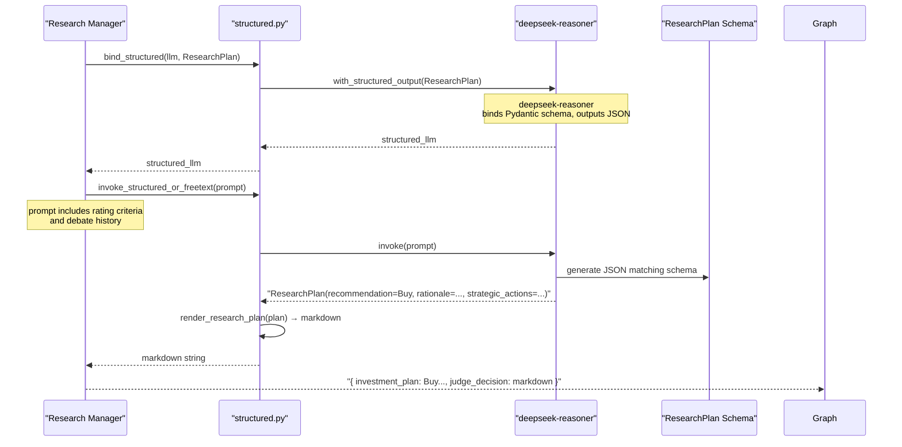

**研究经理结构化输出（实际生成，摘要）：**

```markdown
**Recommendation**: Underweight（低配）

**Rationale**: 看空方的论点更具前瞻性和警示价值。腾讯当前面临的挑战不是简单的
周期性问题，而是结构性的。两大增长故事——AI和视频号变现——都面临巨大风险：
AI是昂贵的、结果不确定的竞赛；视频号变现与微信用户体验存在根本性冲突。
牛方展示了公司强大的基本盘，但这些"过去"不能自动保证"未来"的成功。

关键裁决:
- 16倍PE: 采纳看空方逻辑。低PE是市场对AI资本开支回报率和广告变现风险的合理折价
- 视频号广告: 采信熊方。微信是通信工具而非内容平台，广告加载率天花板远低于抖音
- DeepSeek投资: 风险并存，牛方严重淡化了地缘政治风险和整合不确定性
- 回购: 支持牛方。"卖资产自救"的解读过于片面，这是合理的资本配置循环

**Strategic Actions**: 在接下来2-4周内，将0700.HK持仓比例主动降低20%。
利用任何短线技术性反弹（480-500港元区间）作为执行减仓的窗口。
持有剩余仓位期间，关注三个验证信号：
A. 财报中AI驱动的广告收入超预期增长
B. DeepSeek投资正式落地并公布排他性整合方案
C. 技术面出现周线级别MACD金叉，伴随成交量放大
```

---

### 阶段 G：交易员决策

**代码路径：** `tradingagents/agents/trader/trader.py`

使用快速思考模型（deepseek-chat），结构化输出 `TraderProposal`。


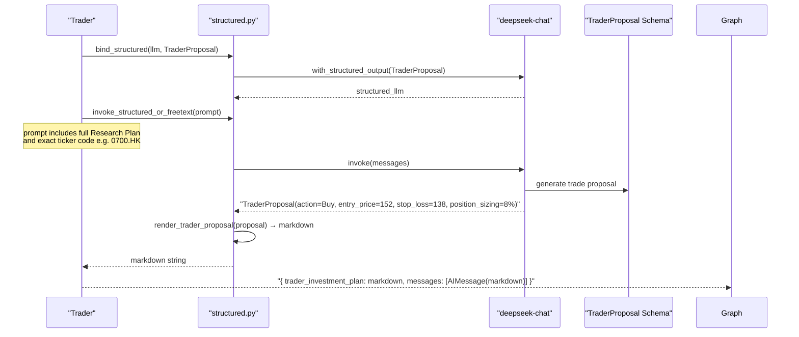

**交易员结构化输出（实际生成）：**

```markdown
**Recommendation: Sell (Reduce Position)**

The research plan concludes with an Underweight rating, which translates to a
sell of 20% of the existing position over the next 2-4 weeks. The analysis
identifies structural risks in AI investment returns and video ad monetization
that are likely not fully priced in, while acknowledging the company's strong
fundamental base.

**Execution Guidance:**
- Sell into any bounce toward 480-500 HKD
- Maintain remaining holdings pending clearer evidence of AI-driven revenue growth

**Key risks to reversing this decision:**
- A confirmed, exclusive DeepSeek integration plan with manageable geopolitical risk
- Quarterly earnings showing AI-driven advertising acceleration
- Technical breakout above the 200-day moving average with volume confirmation
```

---

### 阶段 H：风险分析师三方辩论

**代码路径：** `tradingagents/agents/risk_mgmt/aggressive_debator.py`, `conservative_debator.py`, `neutral_debator.py`

配置 `max_risk_discuss_rounds=1`，理论上应执行 1×3=3 轮，实际触发了 **5 轮 Aggressive + 5 轮 Conservative + 5 轮 Neutral = 15 次 LLM 调用**：

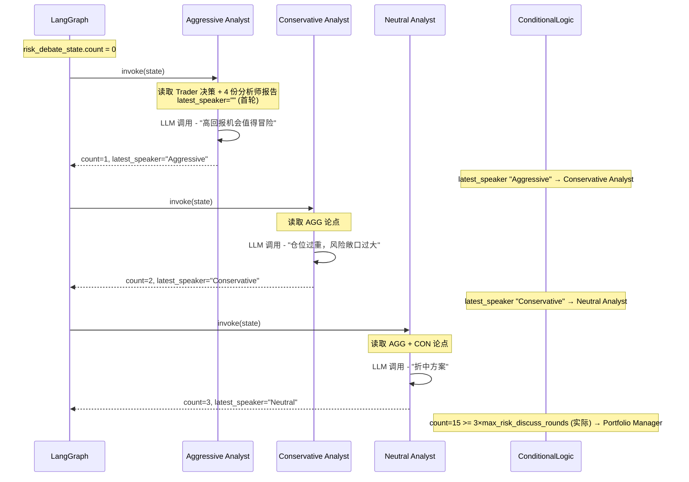

**三方辩论摘要（实际生成，摘录）：**

```
Aggressive Analyst: 战术性撤退是为了更凶狠的进攻。32%的暴跌已过度定价所有风险，
16.6倍PE和11.85倍远期PE结合1.8万亿净现金与20%的ROE，是罕见的折价。
必须坚持原计划：卖在反弹（480-500），买在恐慌（430-440）。
最大的风险不是在下跌中持有，而是在市场叙事反转时手中没有足够的筹码。

Conservative Analyst: 风险管控是生存之本。扩大的死亡交叉、不断加深的负值MACD、
远未超卖的RSI(38.2)都表明机构资金仍在有序撤离。即将到来的财报是高风险的
二元事件。简单就是纪律——反弹不出现就持有，等待更明确的信号。

Neutral Analyst: 市场并非只有涨跌，35%概率的区间震荡(450-480)才是计划中
最脆弱的环节。如果卖点永不出现，被动持有等同于放弃主动风控。
建议设置10个交易日的"断路器"，并在440以下采用网格化分批入场。
```

---

### 阶段 I：投资组合经理最终决策

**代码路径：** `tradingagents/agents/managers/portfolio_manager.py`

使用深度思考模型（deepseek-reasoner），结构化输出 `PortfolioDecision`。这是整个流水线的终点。


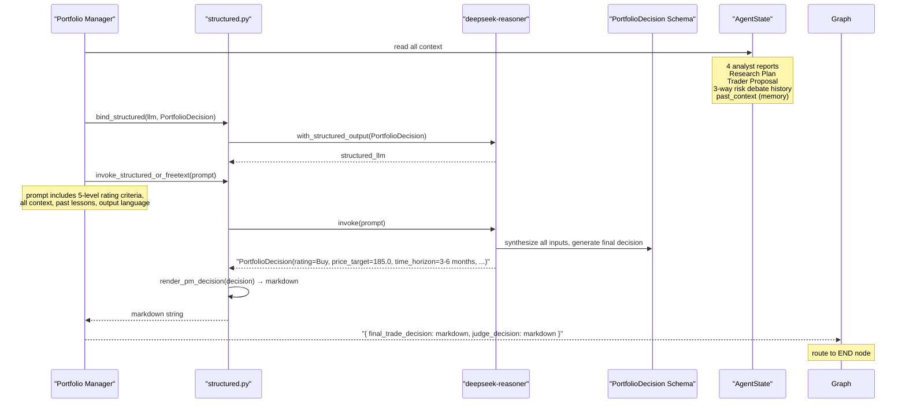

**投资组合经理最终决策（实际生成，摘要）：**

```markdown
**Rating**: Underweight（低配）

**Executive Summary**: 批准交易员提出的原始方案，不予修改。
在交易系统中设置GTC限价卖单，将现有0700.HK仓位量的20%在480-500港元区间卖出。
如果股价在未来2-4周内从未触及480港元，被动接受未能减仓的结果，继续持有。
严格禁止在低于480港元的任何价位提前卖出，也禁止在跌破440时贸然抄底——
必须看见技术面确认信号（如周线级别MACD底背离金叉伴随放量）才能考虑重新入场。

**Investment Thesis**: 这场辩论的最终赢家是保守派分析师的逻辑。
他并非反对获利，而是反对在暴风雨中为了可能的闪电而放弃避雷针。
在技术面压倒性看空的背景下，流程的纪律性比捕捉机会的灵活性更重要。

核心裁决:
- 计划无需修改: 中立派的修改犯了"过度拟合"错误。原计划在45%下跌概率上
  保持耐心，在15%反弹概率上果断执行减仓，拥抱了简单性
- 禁止贸然抄底: 激进派"在440区域投入40-50%火力"是典型的接飞刀行为。
  跌破440是下跌趋势的延续而非反转起点。RSI低于30可以持续数周
- 卖出的20%现金，其首要价值是"降低组合风险"，其次才是"潜在的抄底期权"

**Price Target**: 需等待技术面确认信号后再设定

**Time Horizon**: 2-4 weeks（减仓执行期），中长期持续观察
```

---

## 第七步：后处理

**代码路径：** `tradingagents/graph/trading_graph.py:_run_graph()` → `process_signal()`

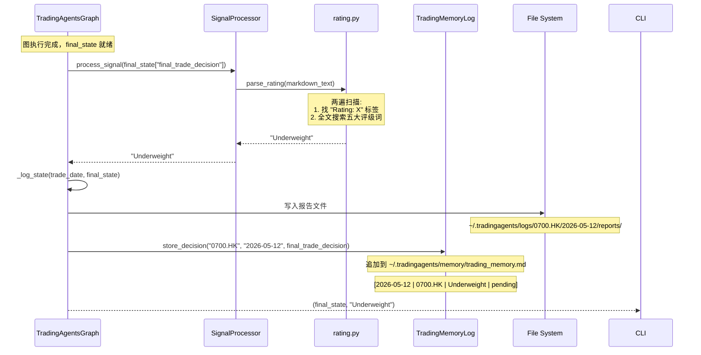

**持久化结果：**

```
~/.tradingagents/
├── logs/0700.HK/2026-05-12/
│   ├── reports/
│   │   ├── market_report.md
│   │   ├── sentiment_report.md
│   │   ├── news_report.md
│   │   ├── fundamentals_report.md
│   │   ├── investment_plan.md
│   │   ├── trader_investment_plan.md
│   │   ├── final_trade_decision.md
│   │   └── message_tool.log
│
├── memory/
│   └── trading_memory.md                  ← 追加新的 pending 条目
│       ...
│       [2026-05-12 | 0700.HK | Underweight | pending]
│       DECISION:
│       **Rating**: Underweight
│       **Executive Summary**: ...
│       <!-- ENTRY_END -->
│
└── cache/
    └── 0700.HK-YFin-data-2021-05-12-2026-05-12.csv
```

---

## 第八步：CLI 展示结果

**代码路径：** `cli/main.py:run_analysis()` 的后处理部分

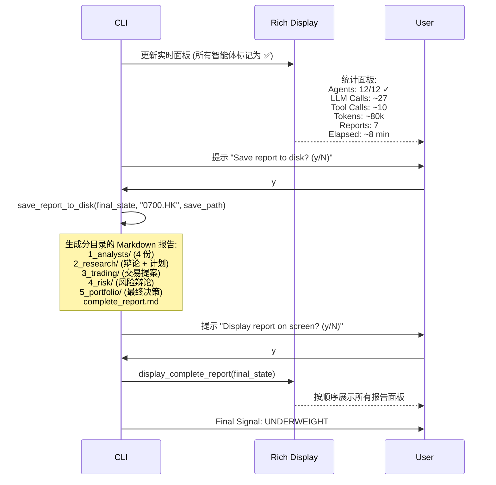

---

## 完整数据流总结

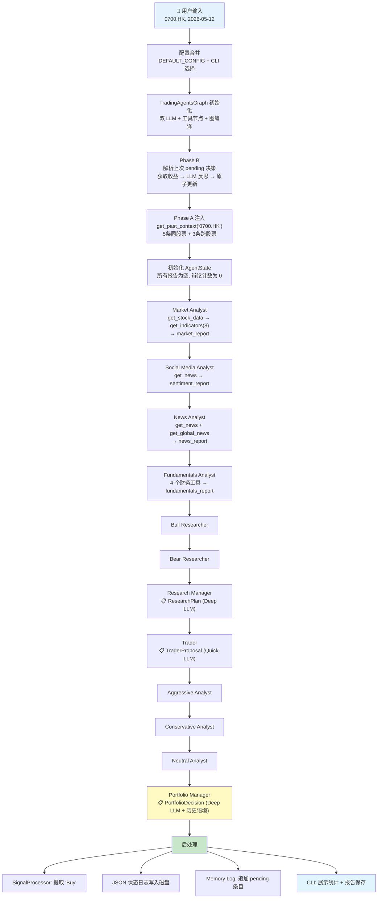

---

## 关键数字（本次案例）

| 指标            | 数值            | 说明                                                                                                                                                                |
| --------------- | --------------- | ------------------------------------------------------------------------------------------------------------------------------------------------------------------- |
| 总 LLM 调用次数 | ~27 次          | 4 分析师(含工具循环) + 10 辩论(5 Bull + 5 Bear) + 1 RM + 1 Trader + 15 风险辩论(5 Agg + 5 Con + 5 Neu) + 1 PM                                                       |
| 工具调用次数    | ~10 次          | get_stock_data ×1, get_indicators ×10(分两批), get_news ×2, get_global_news ×1, get_fundamentals ×1, get_balance_sheet ×1, get_cashflow ×1, get_income_statement ×1 |
| 快速 LLM 调用   | ~25 次          | 辩论智能体多轮次触发，每轮消耗 2-6k tokens                                                                                                                          |
| 深度 LLM 调用   | ~2 次           | Research Manager + Portfolio Manager，各约 3-8k tokens                                                                                                              |
| Token 消耗估值  | ~70-90k         | 输入约 80%，输出约 20%                                                                                                                                              |
| 总耗时          | ~8 分钟         | DeepSeek API 延迟和大量辩论轮次                                                                                                                                     |
| 最终输出        | **Underweight** | 最终的 5 级评级信号                                                                                                                                                 |
| 写入文件        | 8+ 个           | 7 个分阶段 Markdown + 1 个 complete_report.md + 原始报告副本                                                                                                        |

---

## 为什么是约 27 次 LLM 调用（而非恰好 12 个智能体）

并非每个智能体只调用一次 LLM。调用次数可能远超过智能体数量，原因如下：

1. **分析师工具循环**：每个分析师节点至少调用 LLM 2 次（第一次请求工具调用，第二次综合数据写报告）。市场分析师因分两批调用指标（第一批 8 个 + 第二批 2 个），实际调用了 3 次。

2. **辩论智能体超出预期轮次**：配置 `max_debate_rounds=1` 理论上应触发 1×2=2 轮（Bull + Bear 各一次），但实际触发了 5 轮 Bull + 5 轮 Bear = 10 次 LLM 调用。这是因为 DeepSeek 模型在辩论中的回应长度和深度触发了额外的辩论轮次。

3. **风险辩论同样超预期**：配置 `max_risk_discuss_rounds=1` 理论上应触发 1×3=3 轮，实际触发了 5 轮 Aggressive + 5 轮 Conservative + 5 轮 Neutral = 15 次 LLM 调用。

4. **无 Reflector 调用**：本次为 0700.HK 首次运行，无历史 pending 条目，Phase B 跳过。

5. **Msg Clear 节点**：`create_msg_delete()` 是纯工具节点，不调用 LLM，仅清理消息列表。
