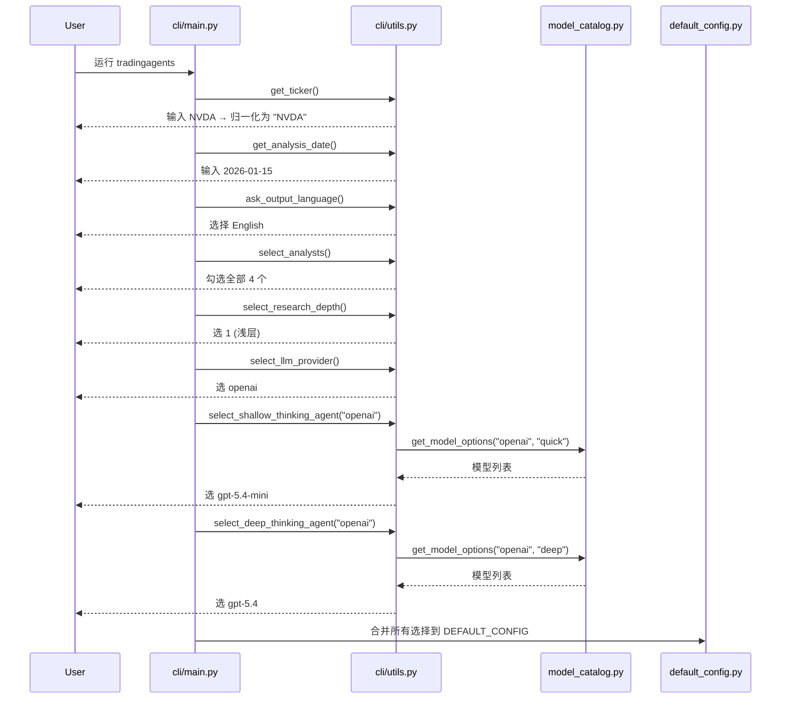
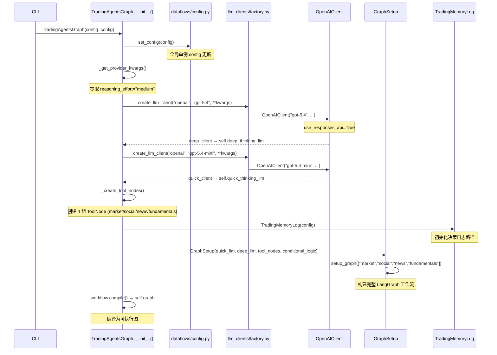
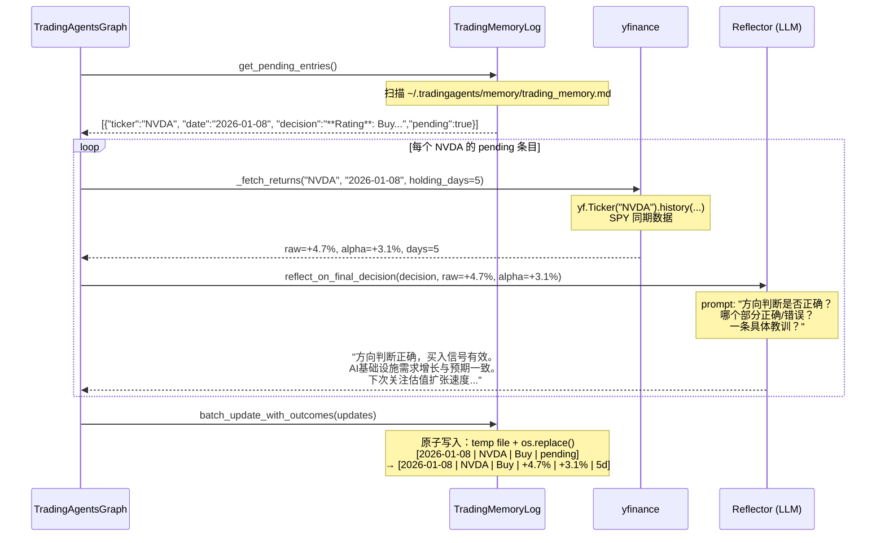
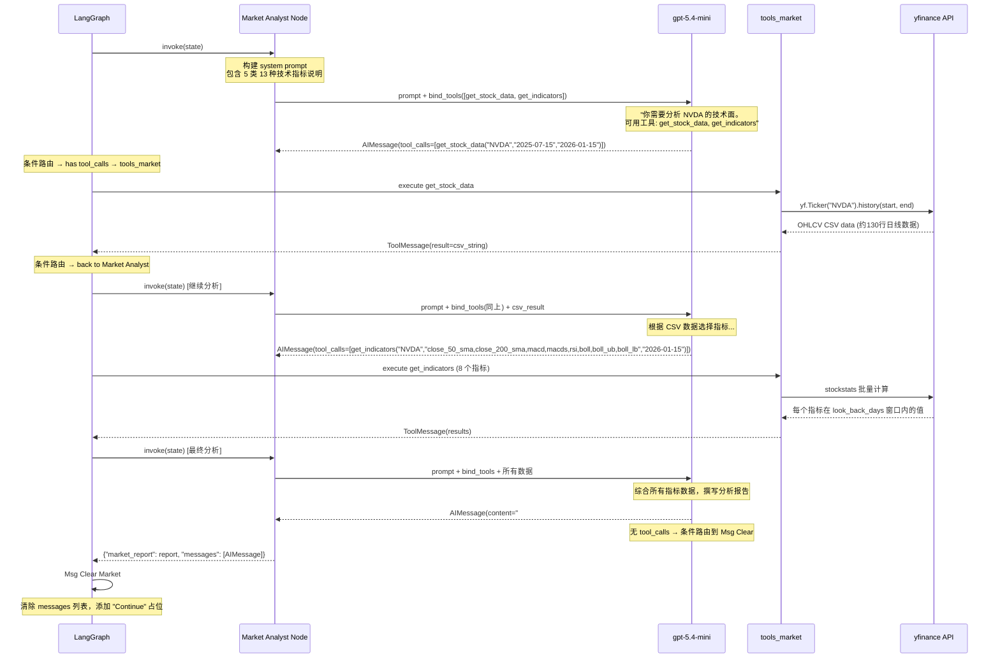
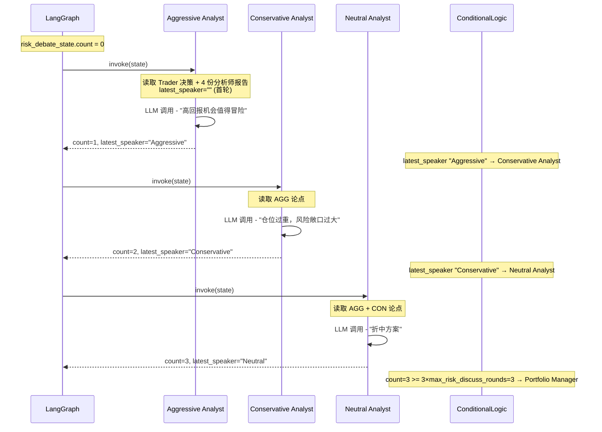
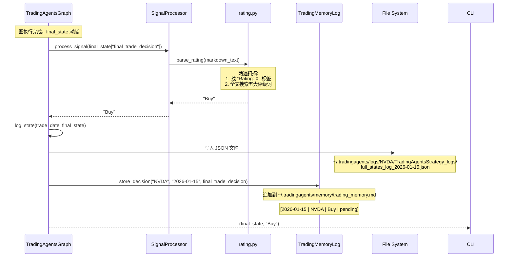
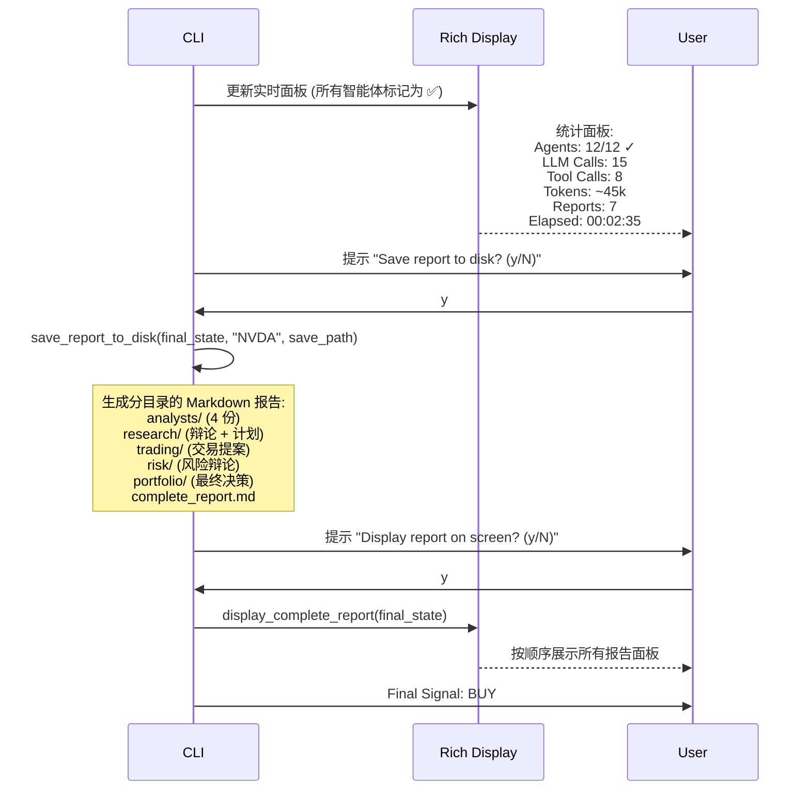

# TradingAgents 端到端案例分析文档

## 案例概览

本文档以 **NVDA（NVIDIA）在 2026-01-15 的单次分析** 为例，逐步记录从用户启动 CLI 到输出最终交易决策的完整过程。每一步均标注对应的代码位置和数据结构变化。

**配置假设：**
- LLM 提供商：OpenAI
- 快速思考模型：gpt-5.4-mini
- 深度思考模型：gpt-5.4
- 分析师：全部 4 个启用（Market + Social + News + Fundamentals）
- 辩论轮次：1 轮
- 风险讨论轮次：1 轮
- 数据源：yfinance

---

## 第一步：启动与用户交互

**代码路径：** `cli/main.py:get_user_selections()` → `cli/utils.py`

用户通过 CLI 交互逐一完成以下配置选择。`cli/utils.py` 中的系列函数调用 questionary 收集输入：

```
┌─────────────────────────────────────────────────────────────┐
│  Welcome to TradingAgents                                   │
├─────────────────────────────────────────────────────────────┤
│  Ticker Symbol: NVDA                                        │
│  Analysis Date: 2026-01-15                                  │
│  Output Language: English                                   │
│  Selected Analysts: [✓] Market  [✓] Social                  │
│                     [✓] News   [✓] Fundamentals             │
│  Research Depth: Deep (5 rounds) → 实际选 1 轮示例            │
│  LLM Provider: OpenAI                                       │
│  Quick-Thinking Model: gpt-5.4-mini                         │
│  Deep-Thinking Model: gpt-5.4                               │
│  Reasoning Effort: medium                                   │
└─────────────────────────────────────────────────────────────┘
```

每个选择的结果汇总为一个 config dict，在 `DEFAULT_CONFIG` 基础上覆盖：

```python
config = {
    "llm_provider": "openai",
    "deep_think_llm": "gpt-5.4",
    "quick_think_llm": "gpt-5.4-mini",
    "openai_reasoning_effort": "medium",
    "max_debate_rounds": 1,
    "max_risk_discuss_rounds": 1,
    "output_language": "English",
    "data_vendors": {"*": "yfinance"},
    # ...
}
```

**用户选择完成后的系统内部行为：**



---

## 第二步：初始化 TradingAgentsGraph

**代码路径：** `tradingagents/graph/trading_graph.py:TradingAgentsGraph.__init__()`

CLI 创建编排器实例并注入配置：

```python
from tradingagents.graph.trading_graph import TradingAgentsGraph

ta = TradingAgentsGraph(debug=True, config=config, callbacks=[stats_handler])
```

初始化过程：



**双轨道 LLM 实例化结果：**

| LLM 变量 | 模型 | 用途 | 使用场景 |
|---------|------|------|---------|
| `self.deep_thinking_llm` | gpt-5.4 | 深度推理 | Research Manager, Portfolio Manager |
| `self.quick_thinking_llm` | gpt-5.4-mini | 快速响应 | 其余 10 个智能体 + Reflector |

**工具节点创建结果（4 组）：**

```
market_tools     → ToolNode([get_stock_data, get_indicators])
social_tools     → ToolNode([get_news])
news_tools       → ToolNode([get_news, get_global_news, get_insider_transactions])
fundamentals_tools → ToolNode([get_fundamentals, get_balance_sheet, get_cashflow, get_income_statement])
```

---

## 第三步：Phase B — 解析历史决策

**代码路径：** `tradingagents/graph/trading_graph.py:propagate()` → `_resolve_pending_entries()`

在运行新的分析之前，系统首先解析上一次同股票（NVDA）运行时留下的 pending 决策。



**此时决策日志中的变化：**

```markdown
<!-- 更新前 -->
[2026-01-08 | NVDA | Buy | pending]

DECISION:
**Rating**: Buy
**Executive Summary**: 买入 NVDA，目标价 $180...
<!-- ENTRY_END -->

<!-- 更新后 -->
[2026-01-08 | NVDA | Buy | +4.7% | +3.1% | 5d]

DECISION:
**Rating**: Buy
**Executive Summary**: 买入 NVDA，目标价 $180...

REFLECTION:
方向判断正确，买入信号有效。AI基础设施需求增长与预期一致，推动股价上涨。下次分析应更关注估值扩张速度，在过快上涨时考虑分批建仓。
<!-- ENTRY_END -->
```

**如果无历史 pending 条目**（首次运行 NVDA），此步骤直接跳过。

---

## 第四步：Phase A — 注入历史上下文

**代码路径：** `tradingagents/graph/trading_graph.py:_run_graph()` → `memory_log.get_past_context()`

```python
past_context = self.memory_log.get_past_context("NVDA")  # n_same=5, n_cross=3
```

`get_past_context()` 的逻辑：

1. 从决策日志中加载所有已解析的条目（排除 pending）
2. 按时间倒序，取最近 **5 条 NVDA 的完整记录**（决策 + 反思）
3. 按时间倒序，取最近 **3 条其他股票的反思记录**（仅反思部分，作为跨股票教训）
4. 格式化为文本块，注入到 Portfolio Manager 的提示词中

```python
# 返回示例 (简化)
past_context = """
Past analyses of NVDA (most recent first):

[2026-01-08 | NVDA | Buy | +4.7% | +3.1% | 5d]
DECISION:
**Rating**: Buy
**Executive Summary**: 买入 NVDA，目标价 $180...
REFLECTION:
方向判断正确。AI基础设施需求增长与预期一致...

[2026-01-01 | NVDA | Overweight | +1.2% | -0.4% | 5d]
DECISION:
**Rating**: Overweight
...
REFLECTION:
...

Recent cross-ticker lessons:

[2026-01-10 | AAPL | +1.8%]
在消费电子需求疲软的环境下，供应链数据比财报数据更能反映真实需求。下次应同时关注台积电等上游供应商的指引。
"""
```

如果没有任何历史记录（首次运行），`past_context` 为空字符串 `""`。

---

## 第五步：初始化 AgentState

**代码路径：** `tradingagents/graph/propagation.py:Propagator.create_initial_state()`

```python
init_agent_state = self.propagator.create_initial_state(
    "NVDA", "2026-01-15", past_context=past_context
)
```

创建的初始状态：

```python
{
    "messages": [HumanMessage("NVDA")],  # LangGraph 消息队列起点
    "company_of_interest": "NVDA",
    "trade_date": "2026-01-15",
    "past_context": "Past analyses of NVDA...",  # ← 第四步获取的历史上下文

    # 以下均为空，等待各智能体填充
    "market_report": "",
    "sentiment_report": "",
    "news_report": "",
    "fundamentals_report": "",

    # 投资辩论状态 (InvestDebateState)
    "investment_debate_state": {
        "bull_history": "",
        "bear_history": "",
        "history": "",
        "current_response": "",
        "judge_decision": "",
        "count": 0,
    },

    "investment_plan": "",
    "trader_investment_plan": "",

    # 风险辩论状态 (RiskDebateState)
    "risk_debate_state": {
        "aggressive_history": "",
        "conservative_history": "",
        "neutral_history": "",
        "history": "",
        "latest_speaker": "",
        "current_aggressive_response": "",
        "current_conservative_response": "",
        "current_neutral_response": "",
        "judge_decision": "",
        "count": 0,
    },

    "final_trade_decision": "",
}
```

---

## 第六步：执行 LangGraph 流水线

**代码路径：** `tradingagents/graph/trading_graph.py:_run_graph()`

```python
final_state = self.graph.invoke(init_agent_state, **args)
```

LangGraph 按照预定义的拓扑顺序执行每个节点，每个节点读取当前状态、产生输出、更新状态。

---

### 阶段 A：市场分析师（Market Analyst）

**代码路径：** `tradingagents/agents/analysts/market_analyst.py:create_market_analyst()`



**市场分析师输出的报告（模拟）：**

```markdown
## Market Analysis: NVDA (Analysis Date: 2026-01-15)

### Trend Overview
NVDA 在过去 6 个月表现出强劲的上升趋势。50日 SMA ($142.30) 始终位于 200日 SMA ($122.87)
之上，形成经典的"金叉"确认。10日 EMA ($148.92) 高于 50日 SMA，显示短期动能仍然向上。

### Momentum Analysis
- **MACD**: 2.31，信号线 1.87，柱状图为正且柱体扩大，表明上涨动量正在加速
- **RSI**: 62.4，处于中性偏强区间（未超买），表明仍有上行空间

### Volatility Assessment
- **布林带**: 上轨 $155.20 / 中轨 $142.30 / 下轨 $129.40
- 当前价格 $152.10 靠近上轨但未突破，表明强势但不极端
- **ATR**: 4.87，过去14天平均波幅约 3.2%，属于正常波动水平

### Volume Analysis
- VWMA 趋势向上，价格高于成交量加权均线，验证了上涨趋势的质量

### Key Insights
1. 整体趋势健康，各时间框架均指向看涨
2. 短期无超买信号，技术面不支持立即回调的判断
3. 关键支撑位: $142 (50 SMA)，关键阻力位: $155 (布林上轨)

| Metric | Value | Signal |
|--------|-------|--------|
| 50 SMA | $142.30 | Bullish |
| 200 SMA | $122.87 | Bullish |
| MACD | 2.31 | Bullish |
| RSI | 62.4 | Neutral-Bullish |
| Bollinger Position | Near Upper | Strong Trend |
```

---

### 阶段 B：社交媒体分析师（Social Media Analyst）

**代码路径：** `tradingagents/agents/analysts/social_media_analyst.py`

流程与市场分析师类似，但使用 `get_news` 工具搜索与 NVDA 相关的社交媒体和新闻：

```
LLM 提示词关注点：社交媒体情绪、Reddit 讨论热度、Twitter/X 情绪
工具调用：get_news("NVDA", "2026-01-08", "2026-01-15")
```

**社交媒体分析师输出的报告（模拟）：**

```markdown
## Social Media Sentiment Analysis: NVDA

### Overall Sentiment Score: 68/100 (Moderately Bullish)

- Reddit r/wallstreetbets: NVDA 提及量上周增长 23%，正面贴比例 65%
- Twitter/X: $NVDA 标签情绪分析显示 62% 正面，28% 中性，10% 负面
- 关键讨论点: Blackwell 架构出货量、CES 2026 主题演讲、数据中心资本开支

### Risk Factor
一篇关于中国出口管制的帖子引发了部分担忧情绪，但整体来看
这种担忧在去年已被市场消化，当前讨论热度有限。
```

---

### 阶段 C：新闻分析师（News Analyst）

**代码路径：** `tradingagents/agents/analysts/news_analyst.py`

使用三个工具：`get_news`（公司新闻）、`get_global_news`（全球宏观）、`get_insider_transactions`（内幕交易）。

**新闻分析师输出的报告（模拟）：**

```markdown
## News Analysis: NVDA & Macro Environment

### Company-Specific News
1. **NVDA 在 CES 2026 发布全新 Blackwell Ultra GPU** — 性能较前代提升 40%
2. **Microsoft 宣布扩大 AI 基础设施投入** — NVDA 为主要 GPU 供应商
3. **台积电 3nm 产能满载** — NVDA 订单排至 2026 Q3

### Macro Environment
- 美联储维持利率不变 (5.25%-5.50%)，市场预期 3 月首次降息
- 全球半导体销售额 YoY +18%，AI 芯片增速领先
- 地缘政治风险：中美科技竞争持续，但短期无新增出口管制

### Insider Transactions
- 过去 3 个月无显著内部人减持记录
- CEO 黄仁勋最近一次交易为 2025-09 的例行 10b5-1 计划售股
```

---

### 阶段 D：基本面分析师（Fundamentals Analyst）

**代码路径：** `tradingagents/agents/analysts/fundamentals_analyst.py`

使用四个工具：`get_fundamentals`、`get_balance_sheet`、`get_cashflow`、`get_income_statement`。

**基本面分析师输出的报告（模拟）：**

```markdown
## Fundamentals Analysis: NVDA

### Company Overview (from yfinance info)
- Market Cap: $3.75T
- P/E (TTM): 42.3
- Forward P/E: 28.7
- Revenue Growth (YoY): +86%
- Gross Margin: 75.2%
- ROE: 128%

### Balance Sheet Highlights
- Cash & Equivalents: $62B
- Total Debt: $12B
- Debt/Equity: 0.18 — 极低杠杆，财务健康

### Cash Flow Analysis
- Operating Cash Flow: $58.2B (TTM)
- Free Cash Flow: $52.1B
- FCF Yield: 1.4%

### Income Statement
- Revenue (TTM): $113.2B
- Net Income (TTM): $52.4B
- EPS (Diluted): $2.11

### Assessment
NVDA 的财务指标在所有维度上都非常强劲。86% 的营收增长率配合 75% 的毛利率，
展现出强大的定价权。Forward P/E 28.7 在 AI 基础设施投入周期中属于合理水平。
最大的风险在于增长减速的可能性——如果 AI 资本开支周期出现拐点，
当前估值可能面临较大回调压力。

| Metric | Value | Assessment |
|--------|-------|------------|
| Revenue Growth | 86% | Exceptional |
| Gross Margin | 75.2% | Industry-leading |
| P/E (Forward) | 28.7 | Reasonable |
| Debt/Equity | 0.18 | Very Low Risk |
| FCF Yield | 1.4% | Acceptable for growth |
```

---

### 阶段 E：多头/空头研究员辩论

**代码路径：** `tradingagents/agents/researchers/bull_researcher.py` 和 `bear_researcher.py`

此时 AgentState 中 4 份完整报告已就绪，辩论循环开始。配置 `max_debate_rounds=1`，共执行 `1 × 2 = 2` 轮（多头→空头各一次）。

```mermaid
sequenceDiagram
    participant Graph as LangGraph
    participant BULL as Bull Researcher
    participant BEAR as Bear Researcher
    participant COND as ConditionalLogic

    Note over Graph: investment_debate_state.count = 0

    Graph->>BULL: invoke(state)
    Note over BULL: 读取 4 份分析师报告<br/>history="" (首轮)<br/>current_response="" (无上次回应)
    BULL->>BULL: LLM 调用 - 构建看涨论点
    BULL-->>Graph: {
        "investment_debate_state": {
            "history": "Bull Analyst: ...",
            "bull_history": "Bull Analyst: ...",
            "current_response": "Bull Analyst: ...",
            "count": 1
        }
    }

    Note over Graph: current_response 以 "Bull" 开头 → Bear Researcher

    Graph->>BEAR: invoke(state)
    Note over BEAR: 读取 4 份分析师报告<br/>history 包含上一轮多头论点<br/>当前 count=1, max=2 (1×2)
    BEAR->>BEAR: LLM 调用 - 构建看跌论点并反驳多头
    BEAR-->>Graph: {
        "investment_debate_state": {
            "history": "Bull Analyst: ...\nBear Analyst: ...",
            "bear_history": "Bear Analyst: ...",
            "current_response": "Bear Analyst: ...",
            "count": 2
        }
    }

    Note over COND: count=2 >= 2×max_debate_rounds=2 → Research Manager
    Graph->>Graph: 进入 Research Manager 节点
```

**多头研究员首轮论点（模拟）：**

```
Bull Analyst: NVDA 在当前时间点是一个极具吸引力的投资机会。

1. 技术面: 50 SMA > 200 SMA 形成黄金交叉，RSI 62.4 显示未超买，
   上涨动量健康。MACD 柱状图扩大表明趋势还在加速。

2. 基本面: 86% 的营收增长、75% 的毛利率、Forward P/E 仅 28.7。
   在 AI 资本支出超级周期的早期阶段，这个估值完全合理。

3. 催化剂: CES 2026 发布了 Blackwell Ultra，性能提升 40%；
   Microsoft 等云厂商持续扩大 AI 基础设施投入；台积电产能满载
   验证了需求的真实性和持续性。

4. 情绪面: 社交媒体情绪正面，机构投资者持续加仓。

综合来看，NVDA 在技术面、基本面和情绪面上均呈现强烈的买入信号。
```

**空头研究员首轮反驳（模拟）：**

```
Bear Analyst: 多头提出了几个有力的论点，但我需要指出被忽视的风险：

1. 估值风险: Forward P/E 28.7 看似合理，但这是建立在"86% 增长可持续"
   的假设上的。历史上没有任何一家万亿美元公司能长期维持这种增速。
   一旦增速放缓至 40% 以下（这几乎是必然的），Forward P/E 将被大幅重估。

2. 技术面局限: RSI 62.4 虽然未超买，但周线级别 RSI 已经连续 8 周
   高于 65，历史上这通常意味着短期顶部。多头引用的 MACD 加速信号，
   在过去三次出现类似模式后，都跟随了 8-12% 的回调。

3. 竞争风险: AMD MI400 系列预计 Q2 2026 上市，Google TPU v6 已在内部部署，
   客户的"第二供应商"策略正在加速。NVDA 的市场份额虽然短期稳固，
   但 95%+ 不可能永远维持。

4. 宏观风险: 虽然降息预期支撑估值，但如果通胀反弹推迟降息，
   高倍数科技股将首当其冲。

建议将入场价设在 $140 (50 SMA 附近) 等待回调，当前价位 $152 追高的风险收益比不对称。
```

---

### 阶段 F：研究经理裁决

**代码路径：** `tradingagents/agents/managers/research_manager.py`

使用深度思考模型（gpt-5.4），结构化输出 `ResearchPlan`。

```mermaid
sequenceDiagram
    participant RM as Research Manager
    participant S as structured.py
    participant LLM as gpt-5.4 (Deep)
    participant Schema as ResearchPlan Schema

    RM->>S: bind_structured(llm, ResearchPlan)
    S->>LLM: with_structured_output(ResearchPlan)
    Note over LLM: 绑定 Pydantic schema → 输出标准 JSON
    LLM-->>S: structured_llm
    S-->>RM: structured_llm

    RM->>S: invoke_structured_or_freetext(prompt)
    Note over RM: prompt 包含: 评级标准、辩论历史

    S->>LLM: invoke(prompt)
    LLM->>Schema: 生成符合 schema 的 JSON
    LLM-->>S: ResearchPlan(recommendation=Buy, rationale=..., strategic_actions=...)
    S->>S: render_research_plan(plan) → markdown
    S-->>RM: markdown string

    RM-->>Graph: {
        "investment_plan": "**Recommendation**: Buy\n\n**Rationale**: ...",
        "investment_debate_state": { "judge_decision": markdown, ... }
    }
```

**研究经理结构化输出（模拟）：**

```markdown
**Recommendation**: Buy

**Rationale**: 本次辩论中，多头的论点在质量和证据强度上明显占优。
多头提供的技术面证据（50/200 SMA 金叉、RSI 中性偏强、MACD 动量加速）
与基本面数据（86% 增长、75% 毛利、Forward PE 28.7）形成了完整的看涨叙事。
空头提出的估值风险和竞争风险有一定道理，但其核心假设——"增速即将大幅放缓"——
缺乏具体的数据支撑。在 AI 基础设施支出仍在加速的背景下，
Forward PE 28.7 对一家增速 86%、毛利 75% 的公司而言并非泡沫水平。

**Strategic Actions**: 建议在当前价位 $152 附近建仓，仓位不超过组合的 8%。
设置止损位于 $138（200 SMA 下方 2%），目标价 $185-190（基于 Forward PE 35x）。
如果回调至 $142（50 SMA）加仓至 12%。关注 Q4 财报（预计 2 月下旬发布）
和 Blackwell Ultra 的出货时间表作为关键催化剂验证点。
```

---

### 阶段 G：交易员决策

**代码路径：** `tradingagents/agents/trader/trader.py`

使用快速思考模型（gpt-5.4-mini），结构化输出 `TraderProposal`。

```mermaid
sequenceDiagram
    participant TR as Trader
    participant S as structured.py
    participant LLM as gpt-5.4-mini
    participant Schema as TraderProposal Schema

    TR->>S: bind_structured(llm, TraderProposal)
    S->>LLM: with_structured_output(TraderProposal)
    LLM-->>S: structured_llm

    TR->>S: invoke_structured_or_freetext(prompt)
    Note over TR: prompt 包含: Research Plan 全文<br/>"NVDA 需要用确切代码..."

    S->>LLM: invoke(messages)
    LLM->>Schema: 生成交易提案
    LLM-->>S: TraderProposal(action=Buy, reasoning=..., entry_price=152, stop_loss=138, position_sizing="8%")
    S->>S: render_trader_proposal(proposal) → markdown
    S-->>TR: markdown string

    TR-->>Graph: {
        "trader_investment_plan": markdown,
        "messages": [AIMessage(markdown)]
    }
```

**交易员结构化输出（模拟）：**

```markdown
**Action**: Buy

**Reasoning**: 综合研究经理的 Buy 评级和分析师团队的一致看涨信号，
当前是合适的入场时机。技术面金叉确认趋势，基本面强劲支撑估值，
CES 2026 新品发布提供短期催化剂。空头提出的回调风险通过在 $138
设置止损来管理，50 SMA ($142) 提供额外缓冲。

**Entry Price**: 152

**Stop Loss**: 138

**Position Sizing**: 8% of portfolio

FINAL TRANSACTION PROPOSAL: **BUY**
```

> `FINAL TRANSACTION PROPOSAL: **BUY**` 这一行由 `render_trader_proposal()` 自动追加，用于向后兼容。

---

### 阶段 H：风险分析师三方辩论

**代码路径：** `tradingagents/agents/risk_mgmt/aggressive_debator.py`, `conservative_debator.py`, `neutral_debator.py`

配置 `max_risk_discuss_rounds=1`，共执行 `1 × 3 = 3` 轮：



**三方辩论摘要（模拟）：**

```
Aggressive Analyst: 同意交易员的 Buy 决策，建议将仓位从 8% 提升至 12%。
AI 板块处于超级周期早期，错过这波行情的风险远大于回调风险。
Blackwell Ultra 发布后将推动新一轮升级周期。历史数据显示，
在类似的技术突破周期中，早期重仓的回报远优于等待回调。

Conservative Analyst: 尽管认可 NVDA 的基本面质量，但必须对仓位进行更严格的控制。
当前 VIX 为 18.7，处于中等水平，但 2 月 FOMC 会议和 Q4 财报是两个
高波动性事件。建议将仓位降至 5%，在财报确认后再考虑加仓。
$152 的入场价距离 50 SMA ($142) 有 7% 的回调空间，等待更好的入场点。

Neutral Analyst: 激进方和保守方都有合理之处。建议采纳交易员的 8% 仓位
和 $138 止损，但增加一个条件：如果 NVDA 跌破 $145（布林带中轨），
主动减仓至 4%，不需等待止损触发。这样既参与了上行行情，
又在技术面走弱时有明确的减仓规则。入场价 $152 可以接受，
但建议分 3 批（$152 3%, $148 3%, $144 2%）完成建仓以平滑成本。
```

---

### 阶段 I：投资组合经理最终决策

**代码路径：** `tradingagents/agents/managers/portfolio_manager.py`

使用深度思考模型（gpt-5.4），结构化输出 `PortfolioDecision`。这是整个流水线的终点。

```mermaid
sequenceDiagram
    participant PM as Portfolio Manager
    participant S as structured.py
    participant LLM as gpt-5.4 (Deep)
    participant Schema as PortfolioDecision Schema
    participant State as AgentState

    PM->>State: 读取所有上下文
    Note over State: - 4 份分析师报告<br/>- Research Plan<br/>- Trader Proposal<br/>- 三方风险辩论历史<br/>- 历史记忆上下文 (past_context)

    PM->>S: bind_structured(llm, PortfolioDecision)
    S->>LLM: with_structured_output(PortfolioDecision)
    LLM-->>S: structured_llm

    PM->>S: invoke_structured_or_freetext(prompt)
    Note over PM: prompt 包含: 5 级评级标准、<br/>所有上下文、历史教训、输出语言指令

    S->>LLM: invoke(prompt)
    LLM->>Schema: 综合所有信息，生成最终决策
    LLM-->>S: PortfolioDecision(
        rating=Buy,
        executive_summary="...",
        investment_thesis="...",
        price_target=185.0,
        time_horizon="3-6 months"
    )
    S->>S: render_pm_decision(decision) → markdown
    S-->>PM: markdown string

    PM-->>Graph: {
        "final_trade_decision": markdown,
        "risk_debate_state": { "judge_decision": markdown, ... }
    }

    Note over Graph: 路由到 END 节点
```

**投资组合经理最终决策（模拟）：**

```markdown
**Rating**: Buy

**Executive Summary**: 在当前价位 $152 建仓 NVDA，初始仓位 8%，分 3 批完成
（$152 3%, $148 3%, $144 2%）。设置止损 $138，目标价 $185。关注 2 月 Q4
财报和 Blackwell Ultra 出货进度作为关键验证点。如果技术面走弱（跌破 $145
布林带中轨），主动减仓至 4%。

**Investment Thesis**: 本次分析中，四个分析师团队在各自领域均给出了看涨信号。
市场分析显示技术面金叉且动量加速；基本面分析确认 86% 营收增长和 75% 毛利，
Forward PE 28.7 在 AI 资本支出超级周期中合理；新闻分析指出 CES 2026 新品
和云厂商持续加大 AI 投入提供了短期催化剂；社交媒体情绪整体正面。

风险辩论中，保守派提出的仓位控制建议值得采纳——在 2 月财报前保持适度仓位
（8% 而非 12%）提供了更好的风险收益比。中立派的分批建仓建议是平衡参与
上行行情和控制回调风险的最佳实践。

历史教训方面，上次 NVDA 分析（2026-01-08）的买入决策获得了 +4.7% 的收益
（Alpha +3.1%），验证了在 AI 基础设施需求增长背景下持续看多 NVDA 的逻辑。
跨股票教训提醒我们关注供应链数据作为先行指标。

**Price Target**: 185

**Time Horizon**: 3-6 months
```

---

## 第七步：后处理

**代码路径：** `tradingagents/graph/trading_graph.py:_run_graph()` → `process_signal()`



**持久化结果：**

```
~/.tradingagents/
├── logs/NVDA/TradingAgentsStrategy_logs/
│   └── full_states_log_2026-01-15.json    ← 完整 JSON 状态快照
│
├── memory/
│   └── trading_memory.md                  ← 追加新的 pending 条目
│       ...
│       [2026-01-15 | NVDA | Buy | pending]
│       DECISION:
│       **Rating**: Buy
│       **Executive Summary**: ...
│       <!-- ENTRY_END -->
│
└── cache/
    └── checkpoints/
        └── NVDA.db                         ← 检查点已自动清除（成功完成）
```

---

## 第八步：CLI 展示结果

**代码路径：** `cli/main.py:run_analysis()` 的后处理部分



---

## 完整数据流总结


---

## 关键数字（本次案例）

| 指标 | 数值 | 说明 |
|------|------|------|
| 总 LLM 调用次数 | ~15 次 | 4 分析师(含工具循环回退) + 2 辩论 + 1 RM + 1 Trader + 3 风险辩论 + 1 PM + 1 Reflection(如触发) + 其他 |
| 工具调用次数 | ~8 次 | get_stock_data ×1, get_indicators ×1, get_news ×2, get_global_news ×1, get_fundamentals ×1, get_balance_sheet ×1, get_cashflow ×1, get_income_statement ×1 |
| 快速 LLM 调用 | ~13 次 | 每个调用约消耗 1-3k tokens |
| 深度 LLM 调用 | ~2 次 | Research Manager + Portfolio Manager，每个约 3-5k tokens |
| Token 消耗估值 | ~40-50k | 输入约 80%，输出约 20% |
| 总耗时 | ~2-3 分钟 | 受 API 延迟和模型选择影响 |
| 最终输出 | **Buy** | 最终的 5 级评级信号 |
| 写入文件 | 8 个 | 7 个分阶段 Markdown + 1 个 complete_report.md + 1 个 JSON 状态日志 |

---

## 为什么是 15 次 LLM 调用（而非恰好 12 个智能体）

并非每个智能体只调用一次 LLM。调用次数可能超过智能体数量，原因如下：

1. **分析师工具循环**：每个分析师节点至少调用 LLM 2 次（第一次请求工具调用，第二次综合数据写报告）。如果工具调用返回的结果不足以完成分析，LLM 可能再次发起工具调用，增加调用次数。

2. **Reflector**：Phase B 解析历史决策时会触发 1 次额外的 LLM 调用（本次案例中有 1 条 pending 条目）。

3. **Msg Clear 节点**：`create_msg_delete()` 是一个纯工具节点，不调用 LLM，仅清理消息列表。

4. **辩论智能体**：每个研究员/风险分析师严格调用 1 次 LLM。
