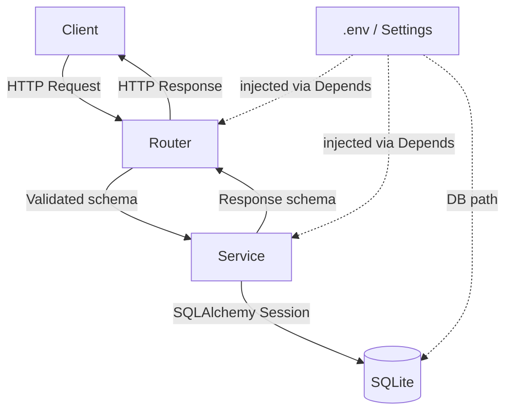
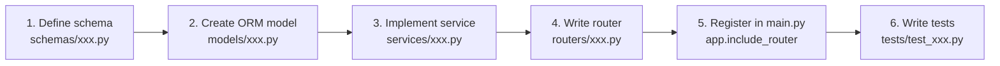

# CLAUDE.md

This document describes the structure, conventions, and commands for the `service/` directory.
The service reads its port from `.env` and exposes an HTTP API built with **FastAPI**.

---

## Tech Stack

| Layer                 | Technology        |
| --------------------- | ----------------- |
| Web framework         | FastAPI           |
| ASGI server           | Uvicorn           |
| ORM                   | SQLAlchemy (sync) |
| Database              | SQLite            |
| Data validation       | Pydantic v2       |
| Environment variables | python-dotenv     |
| Testing               | pytest + httpx    |

---

## Directory Structure

```
service/
├── CLAUDE.md               # This file
├── .env                    # Local env vars (do NOT commit)
├── .env.example            # Env var template (commit this)
├── pyproject.toml          # Dependencies and tool config
│
├── app/
│   ├── main.py             # FastAPI app entry point; registers routers and middleware
│   ├── config.py           # Reads .env and exposes a Settings singleton
│   ├── dependencies.py     # Shared FastAPI dependencies (DB session, current user, etc.)
│   │
│   ├── routers/            # One file per business domain
│   │   ├── __init__.py
│   │   └── health.py       # GET /health
│   │
│   ├── models/             # SQLAlchemy ORM models
│   │   ├── __init__.py
│   │   └── base.py         # declarative_base(); create_all() called on startup
│   │
│   ├── schemas/            # Pydantic request / response schemas
│   │   └── __init__.py
│   │
│   └── services/           # Business logic (no direct HTTP dependency)
│       └── __init__.py
│
└── tests/
    ├── conftest.py         # pytest fixtures (test DB, test client)
    └── test_health.py
```

---

## Architecture Overview



---

## Environment Variables

Create a `.env` file in the `service/` root (see `.env.example`):

```dotenv
# Server port
PORT=8000

# SQLite database file path (relative to service/)
DATABASE_URL=sqlite:///./app.db

# Application environment
ENV=development   # development | production
```

`app/config.py` uses Pydantic `BaseSettings` to load these values.
**Never call `os.environ` directly** — always read from the `Settings` instance.

---

## Database Setup

Tables are created automatically on startup via `Base.metadata.create_all()`.
No migration tool is used at this stage — simply drop and recreate the `.db` file when the schema changes.

```python
# app/db/session.py
from sqlalchemy import create_engine
from sqlalchemy.orm import sessionmaker
from app.config import settings

engine = create_engine(settings.DATABASE_URL, connect_args={"check_same_thread": False})
SessionLocal = sessionmaker(autocommit=False, autoflush=False, bind=engine)
```

```python
# app/dependencies.py
from app.db.session import SessionLocal

def get_db():
    db = SessionLocal()
    try:
        yield db
    finally:
        db.close()
```

```python
# app/main.py — create tables on startup
from app.models.base import Base
from app.db.session import engine

@app.on_event("startup")
def on_startup():
    Base.metadata.create_all(bind=engine)
```

---

## Common Commands

```bash
# Install dependencies
pip install -e ".[dev]"

# Start the dev server (auto-reload)
uvicorn app.main:app --reload --port $(grep PORT .env | cut -d= -f2)

# Run tests
pytest -v

# Run tests with coverage
pytest --cov=app --cov-report=term-missing
```

---

## Coding Conventions

### Routers (`routers/`)

- One file per business domain, declared with `APIRouter(prefix="/xxx", tags=["xxx"])`.
- Route functions only validate input and delegate to a service — **no business logic here**.
- Always declare `response_model=` on every endpoint.

```python
# routers/items.py
from fastapi import APIRouter, Depends
from sqlalchemy.orm import Session
from app.dependencies import get_db
from app.schemas.item import ItemOut
from app.services import item_service

router = APIRouter(prefix="/items", tags=["items"])

@router.get("/{item_id}", response_model=ItemOut)
def get_item(item_id: int, db: Session = Depends(get_db)):
    return item_service.get(db, item_id)
```

### Models (`models/`)

- All ORM classes inherit from `app.models.base.Base`.
- Use standard SQLAlchemy column declarations.

```python
# models/item.py
from sqlalchemy import Column, Integer, String
from app.models.base import Base

class Item(Base):
    __tablename__ = "items"
    id = Column(Integer, primary_key=True, index=True)
    name = Column(String, nullable=False)
```

### Schemas (`schemas/`)

- Use `XxxIn` for request bodies, `XxxOut` for responses.
- All schemas inherit `pydantic.BaseModel` with `model_config = ConfigDict(from_attributes=True)`.

```python
# schemas/item.py
from pydantic import BaseModel, ConfigDict

class ItemIn(BaseModel):
    name: str

class ItemOut(BaseModel):
    id: int
    name: str
    model_config = ConfigDict(from_attributes=True)
```

### Error Handling

- Raise `HTTPException` for business errors; do not return HTTP status codes from the service layer.
- Register global exception handlers in `main.py` using `@app.exception_handler`.

---

## Adding a New Feature



---

## Testing Guidelines

- Name test files `test_<module>.py` and place them under `tests/`.
- Use `httpx.TestClient` (sync) for integration tests against the FastAPI app.
- Use a separate in-memory SQLite database for tests; configure it in `conftest.py`.

```python
# tests/conftest.py
import pytest
from fastapi.testclient import TestClient
from sqlalchemy import create_engine
from sqlalchemy.orm import sessionmaker
from app.main import app
from app.models.base import Base
from app.dependencies import get_db

TEST_DATABASE_URL = "sqlite://"   # in-memory

engine = create_engine(TEST_DATABASE_URL, connect_args={"check_same_thread": False})
TestingSession = sessionmaker(bind=engine)

@pytest.fixture(autouse=True)
def setup_db():
    Base.metadata.create_all(bind=engine)
    yield
    Base.metadata.drop_all(bind=engine)

@pytest.fixture
def client():
    def override_get_db():
        db = TestingSession()
        try:
            yield db
        finally:
            db.close()

    app.dependency_overrides[get_db] = override_get_db
    with TestClient(app) as c:
        yield c
    app.dependency_overrides.clear()
```

---

## Notes for Claude

- **Adding a router**: always call `app.include_router(xxx.router)` in `app/main.py`.
- **Schema changes**: drop and recreate the `.db` file — `create_all()` does not alter existing tables.
- **All config**: read from `app/config.py` `Settings`; never hard-code port or DB path.
- **Sync only**: route functions and service methods use plain `def`, not `async def`; SQLite sessions are synchronous.